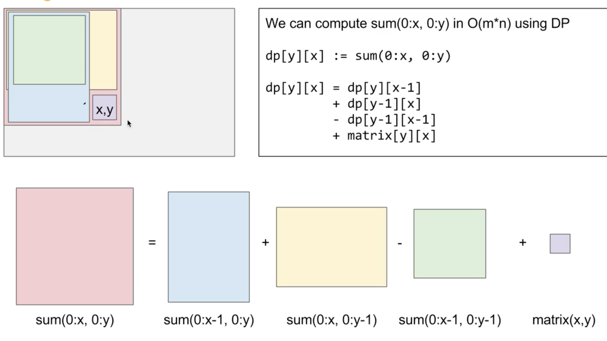
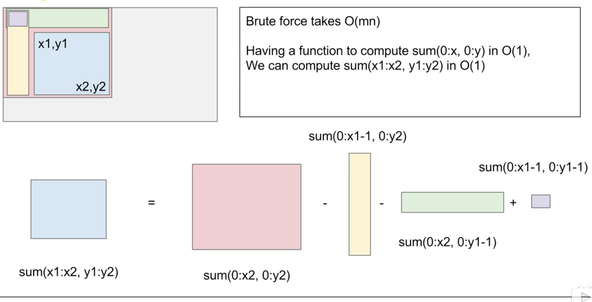

## LeetCode Notes


### Note

+ 获取char数值的方法，不是ascii值: Character.getNumericValue(c);

+ PriorityQueue的add/offer, remove/poll方法时间复杂度都是**logN**

+ \w：与任何字符匹配，包括下划线，等价于"[A-Za-z0-9_]"

  \W：与任何非单词字符匹配, 等价于"[ ^A-Za-z0-9_]"

  ```String[] words = paragraph.replaceAll("\\W+", " ").toLowerCase().split("\\s+");```

+ ```java
  //Map的values转list
  Map<String, List<String>> map;
  List<List<String>> list;
  list = new ArrayList<>(map.values());
  ```

+ ```java
  //digit恢复原数字
  String input = "123";
  int ans = 0;
  for (int i = 0; i < input.length(); i++) {
     int digit = (input.charAt(i) - '0');
     ans = ans * 10 + digit;
  }
  
  //数字求出每一位
  int num = 123;
  while (num != 0) {
     int digit = num % 10;
     num /= 10;
  }
  
  //int变量判断是否大于极限值，不能直接判断，判断ans*10+digit和Integer.MAX_VALUE的大小
  if (Integer.MAX_VALUE / 10 < ans 
      || Integer.MAX_VALUE / 10 == ans && Integer.MAX_VALUE % 10 < digit) {
                  return (sign == 1 ? Integer.MAX_VALUE : Integer.MIN_VALUE);
  }
  ```

+ Leetcode 641双向链表更新问题

  ```java
  public boolean deleteFront() {
      if (capacity == k) return false;
      capacity += 1;
  
      //错误写法，当只有一个有效节点的时候，如果先更新head.next = head.next.next，那么head.next = tail,此时再给调用head.next.next -> tail.next.pre直接crash
      //        head.next = head.next.next;
      //        head.next.next.pre = head;
  
      //正确，因为要调用next,所以不能先更新next
      head.next.next.pre = head;
      head.next = head.next.next;
  
      return true;
  }
  ```

+ List转array的时候不需要for循环赋值，可以用list.toArray()方法，但这样返回的是object类型，需要在toArray()中指定参数类型

  ```java
  int[][] res = list.toArray(new int[0][0]);
  ```

+ **Map按key或者value排序**

  ```java
  List<Map.Entry<Integer, Integer>> list = new ArrayList<>(map.entrySet());
  Collections.sort(list, (o1, o2) -> o1.getKey() - o2.getKey());
  ```

+ **Comparator排序规则**

  + compare方法 return 1表示两个元素需要换位，否则不需要
    + 经常写的(o2, o2) ->  o1 - o2 如果o1 - o2 > 0; 则说明o1>o2, o1 o2要交换,所以是自然序,即之前记的前-后是升序
  + (o2, o2) ->  o2 - o1 如果o2 - o1 < 0 说明o1 > o2 return -1, -1代表不需要换位，所以这时候是降序

+ TreeMap

  + containsKey、get、put 和 remove 的时间复杂度是 log(n)

  + ```java
    //返回小于当前key的最大key，注意是类类型，Integer key = floorKey(key);当不存在的时候key==null
    public K floorKey(K key) {
        return keyOrNull(getFloorEntry(key));
    }
    ```

  + 类似的higherKey是返回大于当前key的最小key
  
+ Heap

  + 堆排序步骤(**ascending**): 
    + 1. 建立**大顶堆**：从最后一个root节点开始和它的左右节点进行比较，如果某一个节点比它大就和其交换，注意这个是个递归的过程，当某个被换下来的节点再次比它的左右节点小的时候需要继续对其进行调整
      2. 排序：建立好大顶堆以后，这个堆并不是有序的，所以需要继续进行排序。将堆顶元素和当前最后一个元素进行交换，这样就将最大元素放到了最后的位置，然后重新堆化，使剩余部分仍然是大顶堆。然后再将堆顶元素和倒数第二个元素进行交换，这样一直进行下去，整个数组就变成有序的了。
  + 堆插入元素：将元素插入到堆的尾部，然后进行堆化过程，即和它的左右节点比较，最终将其放到正确的位置上
  + 堆删除元素：删除头节点(可以理解为PQ.poll()操作)，将堆的最后一个元素移动到头部，然后开始进行堆化，将这个元素调整到正确的位置
  + 链接: https://blog.csdn.net/u011635492/article/details/83046477


### 1. LinkedList

---

#### 23. Merge k Sorted Lists

> **链表和PriorityQueue结合**

```java
class LC23 {
    /**
     * T O(NlogK) k is the length of list node
     * @param lists
     * @return
     */
    public ListNode mergeKLists(ListNode[] lists) {
        PriorityQueue<ListNode> pq = new PriorityQueue<>((o1, o2) -> o1.val - o2.val);
        
        //注意不能在这里把list node的每一个节点添加到pq中，否则在pq.poll的时候会产生死循环
        //比如2->1 这样pq.poll会先出1,然后再出2，就会出现1->2->1...的情况 虽然list node是sorted，相同大小的node也会产生这种情况
        //所以只能将头节点先加入pq,然后出头节点，然后再加次节点，避免次节点先出pq,然后又手动控制指向头节点，头节点本身还在指向次节点的死循环
        for (ListNode l : lists) {
            if (l != null) {
                pq.offer(l);
            }
        }
        
        ListNode dummy = new ListNode(0);
        ListNode curr = dummy;
        while (!pq.isEmpty()) {
            curr.next = pq.poll();
            curr = curr.next;
            if (curr.next != null) {
                pq.offer(curr.next);
            }
        }
        
        return dummy.next;
    }
}
```


#### 445. Add Two Numbers II

```java
class LC445 {
    public ListNode addTwoNumbers(ListNode l1, ListNode l2) {
        Stack<Integer> stack1 = new Stack<>();
        Stack<Integer> stack2 = new Stack<>();
        
        while (l1 != null) {
            stack1.push(l1.val);
            l1 = l1.next;
        }
        
        while (l2 != null) {
            stack2.push(l2.val);
            l2 = l2.next;
        }
        
        int sum = 0;

        //存储当前节点，算出当前位以后指向左边更高位
        ListNode list = new ListNode(0);
        
        while (!stack1.isEmpty() || !stack2.isEmpty()) {
            int val1 = stack1.isEmpty() ? 0 : stack1.pop();
            int val2 = stack2.isEmpty() ? 0 : stack2.pop();
            
            sum += val1 + val2;
            
            //当前位的数值
            int digit = sum % 10;

            //当前位相加后是否有进位
            int carry = sum / 10;
            
            list.val = digit;
            
            //更高位node
            ListNode nextNode = new ListNode(carry);
            nextNode.next = list;
            list = nextNode;
            
            sum /= 10;
        }
        
        return list.val == 0 ? list.next : list;
    }
}
```


#### 24. Swap Nodes in Pairs

```java
class LC24 {
    public ListNode swapPairs(ListNode head) {
        ListNode dummy = new ListNode(0);
        dummy.next = head;
        ListNode curr = dummy;
        
        while (curr.next != null && curr.next.next != null) {
            ListNode first = curr.next, second = curr.next.next;
            //让两个节点交换
            first.next = second.next;
            second.next = first;
            
            //用curr将所有的节点串起来
            curr.next = second;
            curr.next.next = first;
            
            curr = curr.next.next;
            
        }
        
        return dummy.next;
    }
}
```


#### 148. Sort List

```java
class LC148 {
    public static ListNode sortList(ListNode head) {
        //注意这里是递归的终止条件，当head本身为null的时候直接返回null
        //同时如果当head只有一个节点的时候就直接把当前节点return就好了, 如果不return的话，当只剩下一个节点的时候进入死循环
        if (head == null || head.next == null) return head;
        
        ListNode slow = head, fast = head, pre = head;
        
        //1.cut list to 2 parts
        while (fast != null && fast.next != null) {
            pre = slow;
            slow = slow.next;
            fast = fast.next.next;
        }
        
        //将链表切断，否则下次递归的时候fast仍然会一直走到原始链表的尾部
        pre.next = null;
        
        //2. recursively cut until only one node left
        ListNode l1 = sortList(head);
        ListNode l2 = sortList(slow);
        
        //3.merge and sort
        return merge(l1, l2);
    }
    
    private static ListNode merge(ListNode l1, ListNode l2) {
        if (l1 == null) return l2;
        
        if (l2 == null) return l1;
        
        ListNode dummy = new ListNode(0);
        ListNode curr = dummy;
        
        while (l1 != null && l2 != null) {
            if (l1.val < l2.val) {
                curr.next = l1;
                l1 = l1.next;
            } else {
                curr.next = l2;
                l2 = l2.next;
            }
            curr = curr.next;
        }
        
        if (l1 != null) {
            curr.next = l1;
        } else if (l2 != null) {
            curr.next = l2;
        }
        
        return dummy.next;
    }
}
```


### 2. Tree

---

+ **最长路径问题**(不需要经过root): 需要维护两个值
  + 以当前节点为最高节点的最长路径(最大值就是最终结果)
  + 将当前节点左右节点的最长路径返回过父亲节点(左右节点只能选一个)
  + 关联题：124, 543, 687


#### 124. Binary Tree Maximum Path Sum 

求tree中某个sum最大的子树，不需要经过root

```java
private int max = Integer.MIN_VALUE;

public int maxPathSum(TreeNode root) {
  helper(root);
  return max;
}

/**
  * 需要记录两个值
  * 1.当前节点和其左右节点和的最大值，返回给上层，因为如果从上一层走下来只可能选择左边或者右边
  * 2.当前节点和其左右节点的和的最大值(注意如果left<0||right<0的时候是不要将小于0的值加到和里的)
  * 3.将2得到的值和全局max比较，更新max，e.g 当最终走到根节点的时候，判断是根节点最大，还是根节点加上左节点或者右节点或者3个同时加一起最大
     */
private int helper(TreeNode root) {
  if (root == null) {
    return 0;
  }

  //先将左右的返回值和0比较，这样就避免了第一种做法的每次需要3个值相加比较和
  int lmax = Math.max(helper(root.left), 0);
  int rmax = Math.max(helper(root.right), 0);

  //统计以当前节点为最高节点的sum值，并更新最大值
  max = Math.max(max, root.val + lmax + rmax);

  return root.val + Math.max(lmax, rmax);
}
```


#### 235. Lowest Common Ancestor of a Binary Search Tree 

BST的最小公共祖先(LCA)

+ 如果p,q同时小于或者大于当前的根节点，利用BST性质，往左边或右边继续找

+ 当p,q某一个节点的值等于了根节点值, 或者p,q在某一节点上分叉了，那么该点就是LCA
+ 最坏时间 O(N) 该tree是list

```java
class LC235 {
    public TreeNode lowestCommonAncestor(TreeNode root, TreeNode p, TreeNode q) {
        if (root == null || p == null || q == null) return null;
        
        if (p.val < root.val && q.val < root.val) {
            return lowestCommonAncestor(root.left, p, q);
        } else if (p.val > root.val && q.val > root.val) {
            return lowestCommonAncestor(root.right, p, q);
        } else {
            //第一次遇到等于p或者等于q或者p,q分叉在root两边的node就是LCA
            return root;
        }
    }
}
```


#### 236. Lowest Common Ancestor of a Binary Tree   

> 普通binary tree的Lowest common ancestor

```java
/**
 * LCA存在两种情况
 * 1. p, q一个在root左边一个在root右边，此时root就是LCA
 * 2. p, q都在root的同一侧，那么先找到的节点就是LCA
 */
class LC236 {
    public TreeNode lowestCommonAncestor(TreeNode root, TreeNode p, TreeNode q) {
        if (root == null) {
            return null;
        }

        //当找到一个节点的时候将当前节点返回给上层
        if (root.val == p.val || root.val == q.val) {
            return root;
        }

        TreeNode left = lowestCommonAncestor(root.left, p, q);
        TreeNode right = lowestCommonAncestor(root.right, p, q);

        //如果左边没有当前节点，说明p,q都在右边，返回右边先找到的节点作为common ancestor
        if (left == null) {
            return right;
        }

        //如果右边没有当前节点，说明p,q都在左边，返回左边先找到的节点作为common ancestor
        if (right == null) {
            return left;
        }

        //如果左边右边都不为null，说明p, q一个在左边一个在右边，所以此时lca应该是root
        return root;
    }
}
```


#### 250. Count Univalue Subtrees

```java
class Solution {
    private int count = 0;
    
    public int countUnivalSubtrees(TreeNode root) {
        helper(root);
        return count;
    }
    
    private boolean helper(TreeNode root) {
        if (root == null) {
            return true;
        }
        
        //如果是叶子节点的话该节点一定是uni value, count++
        if (root.left == null && root.right == null) {
            count += 1;
            return true;
        }
        
        boolean left = helper(root.left);
        boolean right = helper(root.right);
        
        //如果左子树或者右子树并不是uni value的，那么当前节点一定不是，直接返回false
        if (!left || !right) {
            return false;
        }
        
        //当前节点和左右节点值不相同的时候不是uni value
        if (root.left != null && root.left.val != root.val || root.right != null && root.right.val != root.val) {
            return false;
        }
        
        count += 1;
        return true;
    }
}
```


#### 366. Find Leaves of Binary Tree

bottom-up计数问题

```java
class LC336 {
    private List<List<Integer>> res = new ArrayList<>();
    
    /**
     * bottom->up开始记录层数，将对应层数节点的值加到list对应的index中
     * 每次向上返回的时候层数为左右较大值+1
     * @param root
     * @return
     */
    public List<List<Integer>> findLeaves(TreeNode root) {
        helper(root);
        return res;
    }
    
    private int helper(TreeNode root) {
        if (root == null) {
            return -1;
        }
        
        //注意 这里不能再写if(root.isLeaves) return 0;
        //如果判断叶子节点的话，直接在叶子节点就返回了，就不会走到root==null
        int left = helper(root.left);
        int right = helper(root.right);
        
        //将左右level大的值作为当前节点的level
        int level = Math.max(left, right) + 1;
        
        if (level == res.size()) {
            res.add(new ArrayList<>());
        }
        
      	//注意这个get在level == res.size()外，当前存在就直接取这一层的list
        res.get(level).add(root.val);
        
        return level;
    }
    
}
```


#### 314. Binary Tree Vertical Order Traversal   

错误DFS做法

```java
/**
 * 这道题不能用dfs做，用dfs保证不了节点加入list的顺序，因为先加入左子树，这样比如左子树的某个较深的右节点会先加入到list中，然后右子树较浅的节点才被加入
 * input: [3,9,8,4,0,1,7,null,null,null,2,5]
 * ouput: [[4],[9,5],[3,0,1],[2,8],[7]]
 * expected: [[4],[9,5],[3,0,1],[8,2],[7]]
 */
class LC314_wrongDFS {
    class Node {
        TreeNode node;
        int col;
        
        public Node(TreeNode node, int c) {
            this.node = node;
            col = c;
        }
    }
    
    private Map<Integer, List<Integer>> map = new TreeMap<>();
    
    public List<List<Integer>> verticalOrder(TreeNode root) {
        helper(new Node(root, 0));

        List<List<Integer>> res = new ArrayList<>(map.values());
        
        return res;
    }
    
    private void helper(Node root) {
        if (root.node == null) {
            return;
        }
        
        minCol = Math.min(minCol, root.col);
        
        List<Integer> list = map.getOrDefault(root.col, new ArrayList<>());
        list.add(root.node.val);
        map.put(root.col, list);
        
        helper(new Node(root.node.left, root.col - 1));
        helper(new Node(root.node.right, root.col + 1));
    }
}
```


+ 不用hashmap存储，直接计算offset

```java
class Solution {
    class Node {
        TreeNode node;
        int col;
        
        public Node(TreeNode node, int c) {
            this.node = node;
            col = c;
        }
    }
    
    public List<List<Integer>> verticalOrder(TreeNode root) {
        if (root == null) return new ArrayList<>();
        
        List<List<Integer>> res = new ArrayList<>();
        res.add(new ArrayList<>()); //for root
        Queue<Node> q = new LinkedList<>();
        
        q.offer(new Node(root, 0));
        int minCol = 0, maxCol = 0;
        
        while (!q.isEmpty()) {
            Node n = q.poll();
            int col = n.col;
            TreeNode node = n.node;

            //add to head
            if (col < minCol) {
                minCol = col;
                
                List<Integer> leftList = new ArrayList<>();
                leftList.add(node.val);
                //遇到新的最小值，将该列加入到res的最前面
                res.add(0, leftList);
            } else if (col > maxCol) {
                List<Integer> rightList = new ArrayList<>();
                rightList.add(node.val);
                //直接加入到最后面
                res.add(rightList);
                
                //注意要在加入值后更新maxCol
                maxCol = col;
            } else {
                //col - minCol就是当前的偏移量
                res.get(col - minCol).add(node.val);
            }
            
            if (node.left != null) {
                q.offer(new Node(node.left, col - 1));
            }
            
            if (node.right != null) {
                q.offer(new Node(node.right, col + 1));
            }
        }
        
        return res;
    }
}
```


#### 109. Convert Sorted List to Binary Search Tree    

Given a singly linked list where elements are sorted in ascending order, convert it to a height balanced BST.

```java
/**
 * T: O(nlogn) : 找中点总共需要logn次 每次的时间 n/2 + 2 * n/4 + 4 * n/8...
 * S: O(logn)
 */
class Solution {
    public TreeNode sortedListToBST(ListNode head) {
        return helper(head, null);
    }
    
    private TreeNode helper(ListNode start, ListNode end) {
        if (start == end) return null;
        
        ListNode slow = start, fast = start;
        
        while (fast != end && fast.next != end) {
            slow = slow.next;
            fast = fast.next.next;
        }
        
        TreeNode root = new TreeNode(slow.val);
        root.left = helper(start, slow);
        //这里start要指向slow.next, 否则当只有两个节点的时候fast和slow都不会移动，那么start永远不能到达end，导致stack over flow.
        root.right = helper(slow.next, end);
        
        return root;
    }
}
```


#### 110. Balanced Binary Tree    

是否是平衡二叉树

注意平衡二叉树的定义是任何一个点的左子树和右子树高度不相差超过1

并不是整棵树的最大高度和最小高度相差不超过1, 反例[1,2,2,3,3,3,3,4,4,4,4,4,4,null,null,5,5], 这棵树最大高度最小高度差是2，但是任意节点的左右子树高度差不超过1

```java
class LC110 {
    public boolean isBalanced(TreeNode root) {
        if (root == null) return true;
        
        int left = helper(root.left);
        int right = helper(root.right);
        
        if (Math.abs(left - right) > 1) return false;
        
        return isBalanced(root.left) && isBalanced(root.right);
    }
    
    private int helper(TreeNode root) {
        if (root == null) {
            return 0;
        }
        
        return Math.max(helper(root.left), helper(root.right)) + 1;
    }
}
```


#### 987. Vertical Order Traversal of a Binary Tree  

按垂直方向输出tree node，相同行的两个值按照大小排序

```java
class Solution {
    class NodeCol {
        TreeNode node;
        int col;
        int row;
        
        public NodeCol(TreeNode n, int c, int r) {
            this.node = n;
            this.col = c;
            this.row = r;
        }
    }
    
    private int minCol = 0, maxCol = 0;
    
    public List<List<Integer>> verticalTraversal(TreeNode root) {
        List<List<Integer>> res = new ArrayList<>();
        List<List<NodeCol>> nodeList = new ArrayList<>();
        
        if (root == null) return res;
        
        Queue<NodeCol> q = new LinkedList<>();
        q.offer(new NodeCol(root, 0, 0));
        
        while (!q.isEmpty()) {
            int size = q.size();
            
            NodeCol nc = q.poll();
            TreeNode node = nc.node;
            int col = nc.col;
            int row = nc.row;

            //为了后面将相同行的node按照大小排序，所以list中需要把行列信息都存住
            List<NodeCol> colList;
            if (col < minCol) {
                colList = new ArrayList<>();
                nodeList.add(0, colList);
                minCol = col;
            } else if (col > maxCol) {
                colList = new ArrayList<>();
                nodeList.add(colList);
                maxCol = col;
            } else {
                //注意根节点的情况
                if (nodeList.size() == 0) {
                    colList = new ArrayList<>();
                    nodeList.add(colList);
                } else {
                    colList = nodeList.get(col - minCol);
                }
            }

            colList.add(nc);

            if (node.left != null) {
                q.offer(new NodeCol(node.left, col - 1, row + 1));
            }

            if (node.right != null) {
                q.offer(new NodeCol(node.right, col + 1, row + 1));
            }
        }
        
        for (List<NodeCol> list : nodeList) {
            List<Integer> item = new ArrayList<>();
            //如果有相同行的两个元素，按照大小排序
            Collections.sort(list, (o1, o2) -> {
                if (o1.row == o2.row) {
                    return o1.node.val - o2.node.val;
                }
                
                return 0;
            });
            
            for (NodeCol nc : list) {
                item.add(nc.node.val);
            }
            res.add(item);
        }
        
        return res;
    }
}
```


#### 113. Path Sum II

> 输出和为sum的路径list

```java
class Solution {
    private List<List<Integer>> res = new ArrayList<>();

    public List<List<Integer>> pathSum(TreeNode root, int sum) {
        if (root == null) return res;

        helper(root, 0, sum, new ArrayList<>());
        return res;
    }

    private void helper(TreeNode root, int sum, int target, List<Integer> sol) {
        if (root == null) return;

        sum += root.val;
        sol.add(root.val);

        if (root.left == null && root.right == null) {
            if (sum == target) {
                res.add(new ArrayList<>(sol));
                //当走到满足sum的叶子节点时，在这个if里面就回溯了，remove掉了自己，所以就不会再调用helper(left), helper(right)都返回null之后再remove，所以需要在这里进行回溯
                sol.remove(sol.size() - 1);
                return;
            }
        }

        helper(root.left, sum, target, sol);
        helper(root.right, sum, target, sol);

        sol.remove(sol.size() - 1);
    }
}
```


#### 543. Diameter of Binary Tree 

求最长半径，不一定要经过root

```java
class Solution {
    private int max = 0;

    /**
     * O(n)
     * @param root
     * @return
     */
    public int diameterOfBinaryTree(TreeNode root) {
        helper(root);
        return max;
    }
    
    private int helper(TreeNode root) {
        if (root == null) {
            return 0;
        }
        
        //从低向上
        int left = helper(root.left);
        int right = helper(root.right);
        
        //统计每个节点的最长半径，既它的左子树高度 + 右子树高度
        max = Math.max(max, left + right);
        
        //对每个节点返回它的高度
        return Math.max(left, right) + 1;
    }
    
    /**
     * O(n^2)
     * @param root
     * @return
     */
    public int diameterOfBinaryTree_n2(TreeNode root) {
        if (root == null) {
            return max;
        }
        
        max = Math.max(max, height(root.left) + height(root.right));
        diameterOfBinaryTree(root.left);
        diameterOfBinaryTree(root.right);
        
        return max;
    }
    
    private int height(TreeNode root) {
        if (root == null) {
            return 0;
        }
        
        return Math.max(height(root.left), height(root.right)) + 1;
    }
}
```


#### 549. Binary Tree Longest Consecutive Sequence II ★

```java
class LC549 {
    private int max = 0;
    
    public int longestConsecutive(TreeNode root) {
        helper(root);
        return max;
    }
    
    private int[] helper(TreeNode root) {
        if (root == null) {
            //[incre, decre]
            return new int[]{0, 0};
        }
        
        int incre = 1, decre = 1;
        
        int[] left = helper(root.left);
        
        if (root.left != null) {
            if (root.left.val == root.val + 1) {
                incre = left[0] + 1;
            } else if (root.left.val == root.val - 1) {
                decre = left[1] + 1;
            }
        }
        
        
        int[] right = helper(root.right);
        
        if (root.right != null) {
            if (root.right.val == root.val + 1) {
                incre = Math.max(right[0] + 1, incre);
            } else if (root.right.val == root.val - 1) {
                decre = Math.max(right[1] + 1, decre);
            }
        }
        
        max = Math.max(max, incre + decre - 1);
        
        return new int[]{incre, decre};
    }
}
```


#### 652. Find Duplicate Subtrees ★

> Tree序列化

```java
class LC652 {
    private Map<String, Integer> map = new HashMap<>();
    private List<TreeNode> res = new ArrayList<>();
    
    public List<TreeNode> findDuplicateSubtrees(TreeNode root) {
        dfs(root);
        
        return res;
    }
    
    private String dfs(TreeNode root) {
        if (root == null) return "#";
        
        String serial = root.val + "-" + dfs(root.left) + "-" + dfs(root.right);
        
        map.put(serial, map.getOrDefault(serial, 0) + 1);
        
        if (map.get(serial) == 2) {
            res.add(root);
        }
        
        return serial;
    }
    
}
```


#### 662. Maximum Width of Binary Tree

```java
import java.util.*;

class Solution {
    class Node {
        TreeNode treeNode;
        int pos;
        int depth;
        
        public Node(TreeNode n, int p, int d) {
            treeNode = n;
            pos = p;
            depth = d;
        }
    }
    
    public int widthOfBinaryTree(TreeNode root) {
        if (root == null) return 0;
        
        Queue<Node> q = new LinkedList<>();
        q.offer(new Node(root, 0, 0));
        int left = 0, currDepth = 0;
        int res = 0;
        
        while (!q.isEmpty()) {
            int size = q.size();

            for (int i = 0; i < size; i++) {
                Node node = q.poll();
                int pos = node.pos;
                int depth = node.depth;

                if (node.treeNode.left != null) {
                    q.offer(new Node(node.treeNode.left, 2 * pos, depth + 1));
                }

                if (node.treeNode.right != null) {
                    q.offer(new Node(node.treeNode.right, 2 * pos + 1, depth + 1));
                }
                
                //第一次更新depth的节点一定是最左边的节点
                if (depth > currDepth) {
                    currDepth = depth;
                    left = pos;
                }
                
                //最后一个节点是最右边的节点
                res = Math.max(res, pos - left + 1);
            }
        }
        
        return res;
    }
}
```


#### 687. Longest Univalue Path   

> 有相同值节点的最长路径，不需要过root

```java
/**
* 自己的把node节点通过返回值返回去，这个方法将父亲节点的值传下去
* @param root
* @param val
* @return
*/
private int helper(TreeNode root, int val) {
    if (root == null) return 0;

    int left = helper(root.left, root.val);
    int right = helper(root.right, root.val);

    //计算以当前节点为最高节点的最长高度
    //因为下面应判断了，当节点的值和父亲节点不相等的时候返回0，所以这里可以无条件更新max，不需要再判断是否和父亲节点相等
    max = Math.max(max, left + right);

    if (root.val == val) {
      //当前节点和父亲节点相同的时候更新当前节点的高度，
      return Math.max(left, right) + 1;
    }        

    return 0;
}
```


#### 776.  Split BST ★

```java
class LC776 {
    public TreeNode[] splitBST(TreeNode root, int V) {
        if (root == null) {
            //[SmallorEqual, Large]
            return new TreeNode[]{null, null};
        }
        
        //目标值小于当前节点的值，切割左子树
        if (V < root.val) {
            TreeNode[] res = splitBST(root.left, V);
            //root是大的一边，所以需要连接上被切割的大的一边的子树，而大的一边的子树就存在res[1]中
            root.left = res[1];
            //因为当前root是大的一遍 所以赋值给res[1]
            res[1] = root;
            return res;
        } else { //目标值大于等于当前节点的值，切割右子树
            TreeNode[] res = splitBST(root.right, V);
            //因为要将小于等于的放到res[0]，所以else表示的是root.val <= V
            root.right = res[0];
            res[0] = root;
            return res;
        }
    }
}
```


#### 863. All Nodes Distance K in Binary Tree ★

```java
class LC863 {
    private Map<TreeNode, Integer> map = new HashMap<>();
    
    public List<Integer> distanceK(TreeNode root, TreeNode target, int K) {
        List<Integer> res = new ArrayList<>();
        find(root, target);
        helper(root, map.get(root), K, res);
        return res;
    }
    
    /**
		 * 将target节点标记为level 0, 然后将其上面的父亲节点的level依次标记为level + 1, 其下面的节点不用标记, 因为下面的节点是和目标节点在同一个path上面，dfs过程中可以直接算出来
     * @param root
     * @param target
     * @return
     */
    private int find(TreeNode root, TreeNode target) {
        if (root == null) {
            return -1;
        }
        
        if (root == target) {
            map.put(root, 0);
            return 0;
        }
        
        int left = find(root.left, target);
        if (left >= 0) {
            map.put(root, left + 1);
            //return 当前节点离目标节点的距离
            return left + 1;
        }
        
        int right = find(root.right, target);
        if (right >= 0) {
            map.put(root, right + 1);
            return right + 1;
        }
        
        return -1;
    }
    
    /**
     * 如果该节点存在于map中，则直接取该节点相对于target节点的距离，否则用之前取过的距离+1
     *      1
     *    /  \
     *   2   3
     * 如果2是target节点 那么1存在于map中 level就是1
     * 3不在map中，用1的level + 1，所以3距离2的距离就是2
     */
    private void helper(TreeNode root, int level, int K, List<Integer> res) {
        if (root == null) return;
        if (map.containsKey(root)) {
            level = map.get(root);
        }
        
        if (level == K) {
            res.add(root.val);
        }
        
        helper(root.left, level + 1, K, res);
        helper(root.right, level + 1, K, res);
    }
}
```


#### 894. All Possible Full Binary Trees ★

```java
class LC894 {
    private Map<Integer, List<TreeNode>> cache = new HashMap<>();
    
    public List<TreeNode> allPossibleFBT(int N) {
        if (cache.containsKey(N)) {
            return cache.get(N);
        }
        
        List<TreeNode> res = new ArrayList<>();
        
        if (N % 2 == 0) {
            return res;
        }
        
        if (N == 1) {
            res.add(new TreeNode(0));
            return res;
        }
        
        //以为N只能是偶数才有可能构成full binary tree, 所以N从1开始m i += 2
        for (int i = 1; i < N; i += 2) {
            //枚举所有左子树和右子树
            for (TreeNode leftTree : allPossibleFBT(i)) {
                //左子树i个，根节点1个，所以右子树N-i-1
                for (TreeNode rightTree : allPossibleFBT(N - i - 1)) {
                    TreeNode root = new TreeNode(0);
                    root.left = leftTree;
                    root.right = rightTree;
                    
                    res.add(root);
                }
            }
        }
        
        cache.put(N, res);
        return res;
    }
}
```


#### 958. Check Completeness of a Binary Tree

```java
class LC958 {
    public boolean isCompleteTree(TreeNode root) {
        if (root == null) return true;
        
        //For a complete binary tree, there should not be any node after we met an empty one.
        boolean hasEmptyNode = false;
        Queue<TreeNode> q = new LinkedList<>();
        q.offer(root);
        
        while (!q.isEmpty()) {
            int size = q.size();
            
            for (int i = 0; i < size; i++) {
                TreeNode node = q.poll();
                
                if (node != null) {
                    if (!hasEmptyNode) {
                        q.offer(node.left);
                        q.offer(node.right);
                    } else {
                        //之前有过空节点，则一定不是完全二叉树
                        return false;
                    }
                } else {
                    //第一次遇到空节点的时候记录flag
                    hasEmptyNode = true;
                }
            }
        }
        
        return true;
    }
}
```


#### 971. Flip Binary Tree To Match Preorder Traversal

```java
/**
 *  这道题的意思是交换左子树和右子树能满足match voyage，并且将被交换子树的父节点输出
 */
class LC971 {
    private int index = 0;
    private List<Integer> res = new ArrayList<>();
    
    public List<Integer> flipMatchVoyage(TreeNode root, int[] voyage) {
        dfs(root, voyage);
        
        return res;
    }
    
    private boolean dfs(TreeNode root, int[] v) {
        if (root == null) return true;
        
        //先判断当前节点和对应index的值是否相等，如果不等直接返回false，以为之前不等的时候已经左了交换，如果交换完还不相等则肯定无法match
        if (root.val != v[index]) {
            res = Arrays.asList(-1);
            return false;
        }
        
        index += 1;
        
        //如果左子树节点值和下一个不等，则需要在这个几点将其左子树和右子树交换，即先遍历右子树再遍历左子树
        if (root.left != null && root.left.val != v[index]) {
            res.add(root.val);
            return dfs(root.right, v) && dfs(root.left, v);
        }
        
        return dfs(root.left, v) && dfs(root.right, v);
    }
}
```


#### 1108. Construct Binary Search Tree from Preorder Traversal

```java
class LC1008 {
    //index需要是全局的，如果是局部变量当不满足上下界的时候index会被回溯回去
    private int index = 0;
    
    public TreeNode bstFromPreorder(int[] preorder) {
        return helper(preorder, Integer.MAX_VALUE, Integer.MIN_VALUE);
    }
    
    private TreeNode helper(int[] preorder, int upper, int lower) {
        if (index == preorder.length) {
            return null;
        }
        
        int currVal = preorder[index];
        
       	//如果当前的val不在上下界中，不再继续往深走
        if (currVal < lower || currVal > upper) {
            return null;
        }
        
        TreeNode root = new TreeNode(currVal);
        
        index += 1;
        //往左边走更新上界，往右边走更新下界
        root.left = helper(preorder, currVal, lower);
        root.right = helper(preorder, upper, currVal);
        
        return root;
    }
}
```


#### 1026. Maximum Difference Between Node and Ancestor ★

```java
class LC1026 {
    public int maxAncestorDiff(TreeNode root) {
        if (root == null) return 0;
        
        return helper(root, root.val, root.val);
    }
    
    private int helper(TreeNode root, int max, int min) {
        //每次走到根节点的时候统计这条路径上的最大最小值的差
        if (root == null) {
            return max - min;
        }        
        
        max = Math.max(max, root.val);
        min = Math.min(min, root.val);
        
        int leftDiff = helper(root.left, max, min);
        int rightDiff = helper(root.right, max, min);
        
        //将左右子树差值的最大值返回给上层
        return Math.max(leftDiff, rightDiff);
    }
}
```


#### 1123. Lowest Common Ancestor of Deepest Leaves

```java
class LC1123 {
    private int maxDepth = 0;
    private TreeNode lca = null;
    
    public TreeNode lcaDeepestLeaves(TreeNode root) {
        helper(root, 0);
        return lca;
    }
    
    private int helper(TreeNode root, int level) {
        maxDepth = Math.max(maxDepth, level);
        
        if (root == null) {
            return level;
        }
        
        int leftDepth = helper(root.left, level + 1);
        int rightDepth = helper(root.right, level + 1);
        
        //如果存在某一个节点 左子树的最大深度=右子树的最大深度=整个树的最大深度 那么该点就是最深叶子节点的common ancester
        if (leftDepth == maxDepth && rightDepth == maxDepth) {
            lca = root;
        }
        
        return Math.max(leftDepth, rightDepth);
    }
}
```


### 3. Graph

---

#### 802. Find Eventual Safe States  

> 判断有向图中哪些点不存在环

```java
class Solution {
    /**
     * 判断有向图是否存在环问题
     * visited[i] = 2,代表i在某一个环中，visited[i] = 1代表i访问过并且不在环中
     * 每次先标记的访问的节点为2，当dfs过程中遇到一个访问过的节点的时候，如果该点等于2那么dfs返回false，并把之前一路上过来的节点都返回false
     * 当该节点在dfs的相邻接点中都没有返回false，则将该节点标记为1
     * @param graph
     * @return
     */
    public List<Integer> eventualSafeNodes(int[][] graph) {
        int n = graph.length;
        int[] visited = new int[n];
        List<Integer> res = new ArrayList<>();
        if (n <= 0) return res;
        
        for (int i = 0; i < n; i++) {
            //dfs
            if (dfs(graph, i, visited)) {
                res.add(i);
            }
        }
        
        return res;
    }
    
    private boolean dfs(int[][] graph, int start, int[] visited) {
        //如果该节点已经被访问过，那么该点不能是2 比如 1->2<-3 当访问到2的时候，2的visited已经被标记称了1
        if (visited[start] != 0) {
            return visited[start] == 1;
        }
        
        visited[start] = 2;
        for (int nb : graph[start]) {
            
            if (!dfs(graph, nb, visited)) {
                return false;
            }
        }
        
        visited[start] = 1;
        
        return true;
    }
}
```


#### 1245. Tree Diameter

```java
/**
 * 从任意一点出发，走到最远的点，该点一定在最长的路径上(don"t know why...)
 */
class LC1245 {
    private Map<Integer, List<Integer>> g = new HashMap<>();
    
    public int treeDiameter(int[][] edges) {
        int n = edges.length;
        if (n < 0) return 0;
        
        buildGraph(edges);
        
        //先从任意的0点开始，找到最远的点
        int farestNode = bfs(n, 0).get(0);
        //再从该点出发找最远的路径
        return bfs(n, farestNode).get(1);
    }
    
    private void buildGraph(int[][] edges) {
        for (int[] e : edges) {
            int u = e[0], v = e[1];
            
            g.putIfAbsent(u, new ArrayList<>());
            g.putIfAbsent(v, new ArrayList<>());
            
            g.get(u).add(v);
            g.get(v).add(u);
        }
    }
    
    private List<Integer> bfs(int n, int start) {
        int[] distance = new int[n + 1];
        Arrays.fill(distance, -1);
        
        Queue<Integer> q = new LinkedList<>();
        q.offer(start);
        distance[start] = 0;
        
        while (!q.isEmpty()) {
            int v = q.poll();
            
            if (!g.containsKey(v)) continue;
            
            for (int nb : g.get(v)) {
                if (distance[nb] == -1) {
                    q.offer(nb);
                    distance[nb] = distance[v] + 1;
                }
            }
        }
        
        int p = 0;
        int max = 0;
        
        for (int i = 0; i < distance.length; i++) {
            if (distance[i] > max) {
                max = distance[i];
                p = i;
            }
        }
        
        List<Integer> res = new ArrayList<>();
        res.add(p);
        res.add(max);
        
        return res;
    }
}
```


#### 1334. Find the City With the Smallest Number of Neighbors at a Threshold Distance ★

##### 1. Floyed Warshall

> Time: O(n^3)
>
> Space: O(n^2)

```java
class LC1334 {
    public int findTheCity(int n, int[][] edges, int distanceThreshold) {
        int[][] dp = new int[n][n];
        
        //如果两个点非连通，为了后面能将该两点间距离更新为经过某个中间点的距离，所以这里要初始化为最大值
        for (int[] row : dp) {
            Arrays.fill(row, 10001);
        }
        
        for (int i = 0; i < n; i++) {
            dp[i][i] = 0;
        }
        
        for (int[] e : edges) {
            dp[e[0]][e[1]] = dp[e[1]][e[0]] = e[2];
        }
        
        //必须先循环k，不清楚为什么...
        for (int k = 0; k < n; k++) {
            for (int i = 0; i < n; i++) {
                for (int j = 0; j < n; j++) {
                    dp[i][j] = Math.min(dp[i][j], dp[i][k] + dp[k][j]);
                }
            }
        }
        
        int min = 10001;
        int res = 0;
        
        for (int i = 0; i < n; i++) {
            int count = 0;
            for (int j = 0; j < n; j++) {
                if (dp[i][j] <= distanceThreshold) {
                    count += 1;
                }
            }
            
            if (count <= min) {
                min = count;
                res = i;
            }
        }
        
        return res;
    }
}
```

##### 2. Dijkstra

```java
class LC1334 {
    private Map<Integer, List<int[]>> g = new HashMap<>();
    
    public int findTheCity_dij(int n, int[][] edges, int distanceThreshold) {
        buildGraph(edges);
        
        int res = 0;
        int min = n;
        
        for (int i = 0; i < n; i++) {
            int[] costs = dij(n, i);
            
            int count = 0;
            
            for (int cost : costs) {
                if (cost <= distanceThreshold) {
                    count += 1;
                }
            }
        
            if (count <= min) {
                min = count;
                res = i;
            }
        }
        
        return res;
    }
    
    private void buildGraph(int[][] edges) {
        for (int[] e : edges) {
            int u = e[0], v = e[1], w = e[2];
            
            List<int[]> ulist = g.getOrDefault(u, new ArrayList<>());
            List<int[]> vlist = g.getOrDefault(v, new ArrayList<>());
            
            ulist.add(new int[]{v, w});
            vlist.add(new int[]{u, w});
            
            g.put(u, ulist);
            g.put(v, vlist);
        }
    }
    
    private int[] dij(int n, int src) {
        int[] cost = new int[n];
        Set<Integer> visited = new HashSet<>();
        PriorityQueue<Integer> pq = new PriorityQueue<>((o1, o2) -> cost[o1] - cost[o2]);
        
        Arrays.fill(cost, 10001);
        cost[src] = 0;
        pq.offer(src);
        
        while (!pq.isEmpty()) {
            int v = pq.poll();
            visited.add(v);
            
            List<int[]> nbList = g.get(v);
            if (nbList != null) {
                for (int[] nb : nbList) {
                    int u = nb[0], w = nb[1];
                    
                    if (visited.contains(u)) {
                        continue;
                    }
                    
                    if (cost[u] > w + cost[v]) {
                        cost[u] = w + cost[v];
                        pq.offer(u);
                    }
                }
            }
        }
        
        return cost;
    }
}
```


#### 130. Surrounded Regions

> 从边缘的O开始dfs，只要和边缘的O相连的都不能变成X，其余的O可以变成X

```java
class Solution {
    private int[][] dir = {
        {1, 0},
        {-1, 0},
        {0, 1},
        {0, -1}
    };
    
    public void solve(char[][] board) {
        if (board.length == 0) return;
        int m = board.length, n = board[0].length;
        
        //first row, col from 0 ~ n-1
        for (int j = 0; j < n; j++) {
            if (board[0][j] == 'O') {
                dfs(board, 0, j);
            }
        }
        
        //first col, row from 1 ~ m
        for (int i = 1; i < m; i++) {
            if (board[i][0] == 'O') {
                dfs(board, i, 0);
            }
        }
        
        for (int j = 1; j < n; j++) {
            if (board[m-1][j] == 'O') {
                dfs(board, m-1, j);
            }
        }
        
        for (int i = 1; i < m-1; i++) {
            if (board[i][n-1] == 'O') {
                dfs(board, i, n-1);
            }
        }
        
        for (int i = 0; i < m; i++) {
            for (int j = 0; j < n; j++) {
                if (board[i][j] != '#') {
                    board[i][j] = 'X';
                } else {
                    board[i][j] = 'O';
                }
            }
        }
    }
    
    private void dfs(char[][] board, int startx, int starty) {
        board[startx][starty] = '#';
        for (int[] d : dir) {
            int x = startx + d[0], y = starty + d[1];
            
            if (x <= 0 || y <= 0 || x >= board.length - 1 || y >= board[0].length - 1 || board[x][y] != 'O') {
                continue;
            }
            
            dfs(board, x, y);
        }
    }
}
```


#### 417. Pacific Atlantic Water Flow

```java
class Solution {
    private int[][] dirs = {
        {1, 0},
        {-1, 0},
        {0, 1},
        {0, -1}
    };
    
    private List<List<Integer>> res = new ArrayList<>();
    
    public List<List<Integer>> pacificAtlantic(int[][] matrix) {
        if (matrix.length == 0) return res;
        
        int m = matrix.length, n = matrix[0].length;
        int[][] vis = new int[m][n];
        
        for (int j = 0; j < n; j++) {
            dfs(matrix, 0, j, vis, 1);
            dfs(matrix, m - 1, j, vis, 2);
        }
        
        //注意 这里i不能从1~m-1 因为是两个不同的 在确认pac的时候并没有确认atl
        for (int i = 0; i < m; i++) {
            dfs(matrix, i, 0, vis, 1);
            dfs(matrix, i, n - 1, vis, 2);
        }
        
        for (int i = 0; i < m; i++) {
            for (int j = 0; j < n; j++) {
                if (vis[i][j] == 3) {
                    res.add(Arrays.asList(i, j));
                }
            }
        }
        
        return res;
    }
    
    private void dfs(int[][] matrix, int startx, int starty, int[][] vis, int flag) {
        vis[startx][starty] |= flag;
        
        for (int[] d : dirs) {
            int x = startx + d[0], y = starty + d[1];
            
            if (x < 0 || y < 0 || x >= matrix.length || y >= matrix[0].length || matrix[startx][starty] > matrix[x][y] || (vis[x][y] & flag) != 0) {
                continue;
            }
            
            dfs(matrix, x, y, vis, flag);
        }
    }
}
```


### 4. DFS

---

#### 210. Course Schedule II 

排课问题，可以用拓扑排序和DFS做

> 1. dfs判断环的过程中不能简单判断visited[i] = true，因为叶子节点可能被访问多次(1和3都指向2, 1->2<-3), 所以需要用0,1,2判断是否是叶子节点被访问多次还是某个点存在环。
>
> 2. 当遍历完邻接点以后最先出来的就是叶子节点，再是其他相邻节点都遍历完成的节点
> 3. 不需要考虑连通问题，不连通的节点就是没有预先课程

```java
// T: O(n); S: O(n) 每个节点最多访问一遍
class Solution {
    private List<Integer> list = new ArrayList<>();
    private boolean hasCycle = false;
    
    public int[] findOrder(int n, int[][] pre) {
        int[] res = new int[n];
        //当没有预先课程条件的时候，每个课程的预先课程就是自己本身
        if (pre.length == 0) {
            for (int i = 0; i < n; i++) {
                res[i] = i;
            }
            return res;
        }
        
        List<Integer>[] table = new ArrayList[n];
        int[] visited = new int[n];
        
        //构建有向图
        for (int[] v : pre) {
            //vi -> vo
            int vi = v[1], vo = v[0];
            
            if (table[vi] == null) {
                table[vi] = new ArrayList<>();
            }
            table[vi].add(vo);
        }
        
        for (int i = 0; i < n; i++) {
            //dfs
            if (visited[i] == 0 && !hasCycle) {
                dfs(table, i, visited);
            }
        }
        
        if (hasCycle) return new int[0];
        
        for (int i = 0; i < list.size(); i++) {
            res[i] = list.get(list.size() - i - 1);
        }
        
        return res;
    }
    
    private void dfs(List<Integer>[] table, int start, int[] visited) {
        visited[start] = 1;
        if (table[start] != null) {
            for (int nb : table[start]) {
                //如果在以某个点做dfs的过程中遇到了visited[nb] == 1，则一定是环,直接return(因为是有向图，如果不存在连接的话不回访问前一节点)
                //如果没有在过程中发现环，则从最后一个节点开始往回溯标记visited[start]
                if (visited[nb] == 1) {
                    hasCycle = true;
                    return;
                } else if(visited[nb] == 0) {
                    dfs(table, nb, visited);
                }
            }
        }
        
        //当相邻节点都访问完以后，加到list中，最先加进去的肯定是出度为0的叶子结点，就是最后才可以上的课程
        //也就是先加进list的是最后才可以上的课
        //visited == 2的是叶子节点，可以有多个点指向这个叶子节点 所以不是环
        //但如果某一个点不是叶子节点，并且在dfs过程中还可以被访问第二次，则存在环
        visited[start] = 2;
        list.add(start);
    }
}
```


#### 212. Word Search II 

dfs与字典数结合

+ 超时做法，记录一个String curr,然后将当前char append进来，然后调用字典树的search方法从头找
+ 第一次dfs的时候不能入空字符串，直接找第一个

```java
import java.util.*;
class Solution {
    private int[][] dir =  {
        {1, 0},
        {-1, 0},
        {0, 1},
        {0, -1}
    };
    
    private List<String> res = new ArrayList<>();
    
    public List<String> findWords(char[][] board, String[] words) {
        
        for (String s : words) {
            insert(s);
        }
        
        int m = board.length, n = board[0].length;
        for (int i = 0; i < m; i++) {
            for (int j = 0; j < n; j++) {
                //dfs 这里不能入‘’值，直接找第一个字母
                dfs(board, i, j, board[i][j], root);
            }
        }
        
        return res;
    }
    
    public void dfs(char[][] board, int startx, int starty, char c, TrieNode t) {
        if (t.children[c - 'a'] == null) {
            return;
        }
        
        //trie的root节点是个虚节点，所以要先找到第一个包含字母的children
        t = t.children[c - 'a'];
        
        if (t.word != null && !res.contains(t.word)) {
            res.add(new String(t.word));
            t.word = null;
            // return; ***这里不能return，因为可能存在相同前缀的词，所以找到一个以后还要继续找
        }

        char letter = board[startx][starty];
        board[startx][starty] = '#';
        
        for (int[] d : dir) {
            int x = startx + d[0], y = starty + d[1];
            
            if (x < 0 || y < 0 || x >= board.length || y >= board[0].length || board[x][y] == '#') {
                continue;
            }
            
            dfs(board, x, y, board[x][y], t);
        }
        
        board[startx][starty] = letter;
        
    }
    
    class TrieNode{
        String word;
        TrieNode[] children;
        
        public TrieNode() {
            word = null;
            children = new TrieNode[26];
        }
    }
    
    private TrieNode root = new TrieNode();

    public void insert(String word) {
        TrieNode curr = root;

        for (int i = 0; i < word.length(); i++) {
            char c = word.charAt(i);

            if (curr.children[c - 'a'] == null) {
                curr.children[c - 'a'] = new TrieNode();
            }

            curr = curr.children[c - 'a'];
        }

        curr.word = word;
    }
}
```


- Version 2

```java
class Solution {
    class TrieNode {
        TrieNode[] children;
        String word;
        
        public TrieNode() {
            children = new TrieNode[26];
            word = "";
        }
    }
    
    private TrieNode root = new TrieNode();
    private int[] d = {0, 1, 0, -1, 0};
    private List<String> res = new ArrayList<>();
    
    public List<String> findWords(char[][] board, String[] words) {
        if (board == null || board.length == 0 || words == null || words.length == 0) return res;
        int m = board.length, n = board[0].length;
        add(words);
        
        for (int i = 0; i < m; i++) {
            for (int j = 0; j < n; j++) {
                dfs(board, i, j, root);
            }
        }
        
        return res;
    }
    
    private void dfs(char[][] board, int x, int y, TrieNode node) {
        char c = board[x][y];
        //这里需要先下一层把root的虚节点跳过去，否则当board只有一个字母的时候就会check root的虚节点
        if (node.children[c - 'a'] == null) {
            return;
        }
        
        node = node.children[c - 'a'];
        int m = board.length, n = board[0].length;
        
        if (!node.word.equals("")) {
            res.add(node.word);
            node.word = "";
        }
        
        char org = board[x][y];
        board[x][y] = '#';
        
        for (int i = 0; i < 4; i++) {
            int nx = x + d[i], ny = y + d[i+1];
            
            if (nx < 0 || ny < 0 || nx >= m || ny >= n || board[nx][ny] == '#' || node.children[board[nx][ny] - 'a'] == null) continue;

            dfs(board, nx, ny, node);
        }
        
        board[x][y] = org;
    }
    
    private void add(String[] words) {
        for (String w : words) {
            TrieNode node = root;
            char[] ca = w.toCharArray();
            
            for (int i = 0; i < ca.length; i++) {
                int index = ca[i] - 'a';
                if (node.children[index] == null) {
                    node.children[index] = new TrieNode();
                }
                node = node.children[index];
            }
            
            node.word = w;
        }
    }
}
```


#### 329. Longest Increasing Path in a Matrix ★

```java
package backtrack;
import java.util.*;

class LC329 {
    private int[] d = {0, 1, 0, -1, 0};
    
    public int longestIncreasingPath(int[][] matrix) {
        if (matrix == null || matrix.length == 0) return 0;
        
        int m = matrix.length, n = matrix[0].length;
        int[][] memo = new int[m][n];
        
        for (int[] row : memo) {
            Arrays.fill(row, -1);
        }
        
        int max = 0;
        
        for (int i = 0; i < m; i++) {
            for (int j = 0; j < n; j++) {
                max = Math.max(max, dfs(matrix, i, j, memo));
            }
        }
        
        return max;
    }
    
    /**
     * memo[x][y]记录从x，y出发的最长路径
     */
    private int dfs(int[][] matrix, int x, int y, int[][] memo) {
        if (memo[x][y] != -1) return memo[x][y];
        
        int m = matrix.length, n = matrix[0].length;
        
        int max = 1;
        
        for (int i = 0; i < 4; i++) {
            int nx = x + d[i], ny = y + d[i+1];
            
            if (nx < 0 || ny < 0 || nx >= m || ny >= n || matrix[nx][ny] <= matrix[x][y]) {
                continue;
            }
            
            //记录从当前层开始能走的最远路径
            int path = 1 + dfs(matrix, nx, ny, memo);
            max = Math.max(max, path);
        }
        
        memo[x][y] = max;
        
        return max;
    }
}
```


#### 490. Maze

```java
class LC490 {
    private int[] d = {0, 1, 0, -1, 0};
    private boolean arrive = false;
    
    public boolean hasPath(int[][] maze, int[] start, int[] destination) {
        if (maze == null || maze.length == 0) return false;
        
        int m = maze.length, n = maze[0].length;
        
        boolean[][] visited = new boolean[m][n];
        dfs(maze, start, destination, visited);
        return arrive;
    }
    
    private void dfs(int[][] maze, int[] start, int[] dest, boolean[][] visited) {
        if (visited[start[0]][start[1]]) return;
        
        visited[start[0]][start[1]] = true;
        
        for (int i = 0; i < 4; i++) {
            int x = start[0] + d[i], y = start[1] + d[i+1];
            
            //先判断一下当前走一步是否有效，如果无效就不再往该方向继续走了
            if (x < 0 || y < 0 || x >= maze.length || y >= maze[0].length || maze[x][y] == 1 || visited[x][y]) {
                continue;
            }
            
            //走一步有效的情况下，判断是否可以往该方向继续走
            while (x >= 0 && y >= 0 && x < maze.length && y < maze[0].length && maze[x][y] == 0) {
                x += d[i];
                y += d[i+1];
            }
            
            //因为出while循环的时候刚好是第一个不满足条件的格子，所以退回一步
            x -= d[i];
            y -= d[i+1];
            
            //出了while循环说明当前方向已经走不下去了，需要换方向了，但也可以在该点停下来，判断一下该点是否是目标点
            if (x == dest[0] && y == dest[1]) {
                arrive = true;
                return;
            }
            
            //如果不是目标点则换一个方向继续走
            dfs(maze, new int[]{x, y}, dest, visited);
        }
    }
}
```


#### 721. Accounts Merge ★

```java
class LC721 {
    private Map<String, Set<String>> g = new HashMap<>();
    private Map<String, String> emailToName = new HashMap<>();
    private Set<String> emails = new HashSet<>();
    
    public List<List<String>> accountsMerge(List<List<String>> accounts) {
        List<List<String>> res = new ArrayList<>();
        
        if (accounts == null || accounts.size() == 0) return res;
        
        Set<String> visited = new HashSet<>();
        
        buildGraph(accounts);
        
        for (String e : emails) {
            List<String> related = new ArrayList<>();
            dfs(e, visited, related);
            
            Collections.sort(related);
            
            if (related.size() > 0) {
                List<String> account = new ArrayList<>();
                String name = emailToName.get(e);
                account.add(name);
                account.addAll(related);

                res.add(account);
            }
        }
        
        return res;
    }
    
    private void dfs(String start, Set<String> visited, List<String> related) {
        if (visited.contains(start)) return;
        
        visited.add(start);
        related.add(start);
        
        if (g.get(start) != null) {
            for (String nb : g.get(start)) {
                dfs(nb, visited, related);
            }
        }
    }
    
    private void buildGraph(List<List<String>> accounts) {
        for (List<String> acc : accounts) {
            String name = acc.get(0);
            for (int i = 1; i < acc.size(); i++) {
                emails.add(acc.get(i));
                emailToName.put(acc.get(i), name);
                
                if (i == 1) continue;
                    
                String first = acc.get(i-1), second = acc.get(i);
                g.putIfAbsent(first, new HashSet<>());
                g.putIfAbsent(second, new HashSet<>());
                
                g.get(first).add(second);
                g.get(second).add(first);
            }
        }
    }


    /**
     * Union Find
     * 将不同的account根据email合并到一起
     */
    public List<List<String>> accountsMergeUf(List<List<String>> accounts) {
        List<List<String>> res = new ArrayList<>();
        
        if (accounts == null || accounts.size() == 0) return res;
        
        int n = accounts.size();
        
        int[] root = new int[n];
        
        for (int i = 0; i < n; i++) {
            root[i] = i;
        }
        
        Map<String, Integer> emailToAccIndex = new HashMap<>();
        
        for (int i = 0; i < n; i++) {
            List<String> acc = accounts.get(i);
            for (int j = 1; j < acc.size(); j++) {
                String email = acc.get(j);
                
                //如果map中已经包含了这个email，则将两个account的index进行合并
                if (emailToAccIndex.containsKey(email)) {
                    int preIndex = emailToAccIndex.get(email);
                    
                    //将两个account的index进行合并
                    union(preIndex, i, root);
                } else {
                    emailToAccIndex.put(email, i);
                }
            }
        }
        
        Map<Integer, Set<String>> emailSet = new HashMap<>();
             
        for (int i = 0; i < n; i++) {
            //因为将不同的email根据index已经进行了合并，所以此处find的index就是同一个account的index，并将这些email都加到同一个set总
            int index = find(i, root);
            
            emailSet.putIfAbsent(index, new HashSet<>());
            
            for (int j = 1; j < accounts.get(i).size(); j++) {
                emailSet.get(index).add(accounts.get(i).get(j));
            }
        }
        
        for (int index : emailSet.keySet()) {
            List<String> item = new ArrayList<>();
            item.add(accounts.get(index).get(0));
            
            List<String> emailList = new ArrayList<>(emailSet.get(index));
            Collections.sort(emailList);
            item.addAll(emailList);
            res.add(item);
        }
        
        return res;
    }
    
    private int find(int x, int[] root) {
        if (x != root[x]) {
            root[x] = find(root[x], root);
        }
        
        return root[x];
    }
    
    private void union(int x, int y, int[] root) {
        root[find(x, root)] = root[find(y, root)];
    }
} 
```


#### 886. Possible Bipartition

> graph颜色标记问题

```java
class LC886 {
    private Map<Integer, Set<Integer>> g = new HashMap<>();
    
    public boolean possibleBipartition(int N, int[][] dislikes) {
        buildGraph(N, dislikes);
        
        int[] colors = new int[N + 1];
        
        for (int i = 1; i <= N; i++) {
            if (colors[i] == 0 && !dfs(i, 1, colors)) {
                return false;
            }
        }
        
        return true;
    }
    
    private boolean dfs(int start, int color, int[] colors) {
        if (colors[start] != 0) {
            return colors[start] == color;
        }
        
        colors[start] = color;
        
        for (int nb : g.get(start)) {
            if (!dfs(nb, -color, colors)) {
                return false;
            }
        }
        
        return true;
    }
    
    private void buildGraph(int N, int[][] dis) {
        for (int i = 1; i <= N; i++) {
            g.put(i, new HashSet<>());
        }
        
        for (int[] d : dis) {
            g.get(d[0]).add(d[1]);
            g.get(d[1]).add(d[0]);
        }
    }
}
```


#### 1219. Path with Maximum Gold

> 不能用bfs+pq做, 因为没有办法知道pq重新开始新起点以后的值
>
> 用dfs统计出在当前节点的4个方向上每个方向能走到的最大值

```java
class LC1219 {
    private int[][] dir = {
        {1, 0},
        {-1, 0},
        {0, 1},
        {0, -1}
    };
    
    public int getMaximumGold(int[][] grid) {
        int m = grid.length, n = grid[0].length;
        int max = 0;
        Set<Integer> visited = new HashSet<>();
        
        for (int i = 0; i < m; i++) {
            for (int j = 0; j < n; j++) {
                if (grid[i][j] == 0 || visited.contains(i * n + j)) continue;
                
                max = Math.max(max, dfs(grid, i, j, visited));
            }
        }
        
        return max;
    }
    
    private int dfs(int[][] grid, int startx, int starty, Set<Integer> visited) {
        int count = grid[startx][starty];
        int m = grid.length, n = grid[0].length;
        visited.add(startx * n + starty);
        
        int max = 0;
        for (int[] d : dir) {
            int x = startx + d[0], y = starty + d[1];
            
            if (x < 0 || y < 0 || x >= m || y >= n || grid[x][y] == 0 || visited.contains(x * n + y)) {
                continue;
            }
            
            max = Math.max(dfs(grid, x, y, visited), max);
        }
        
        visited.remove(startx * n + starty);
        
        return count + max;
    }
}
```


### 5. BFS

---

#### 126. Word Ladder II ★

> BFS+DFS+backtrack

```java
/**
 * 1. 先用bfs从begin开始到end过程中所有经过的word标记距离，记录在dist中
 * 2. 用dfs从从begin开始，每次找dist中距离当前word为1的neighbor进行搜索，当到达end的时候记录一条有效路径，然后在backtrack
 */
class LC126 {
    private Map<String, Integer> dist = new HashMap<>();
    private Map<String, List<String>> g = new HashMap<>();
    private List<List<String>> res = new ArrayList<>();
    
    public List<List<String>> findLadders(String beginWord, String endWord, List<String> wordList) {
        if (wordList == null || wordList.size() == 0) return res;
        
        Set<String> dict = new HashSet<>(wordList);
        dict.add(beginWord);

        /** 提前将dict中所有的word都进行查找neighbors,然后将其加入到g中
         *  这样会导致一些无法从begin到达的word也被加入到了g中，所以在dfs过程中还需要判断dist.get(nb) != null,因为所有的word不一定在dist的map中
            g.put(beginWord, getNeighbors(beginWord, dict));
            
            for (String w : wordList) {
                g.put(w, getNeighbors(w, dict));
            }
        */

        if (bfs(beginWord, endWord)) {
            dfs(beginWord, endWord, new ArrayList<>());
        }
         
        
        return res;
    }
    
    private boolean bfs(String begin, String end, Set<String> dict) {
        Queue<String> q = new LinkedList<>();
        q.offer(begin);
        dist.put(begin, 0);
        
        while (!q.isEmpty()) {
            int size = q.size();
            
            for (int i = 0; i < size; i++) {
                String curr = q.poll();
                
                if (curr.equals(end)) return true;
                
                int d = dist.get(curr);

                //只将在bfs过程中可以达到的词进行查找neighbor并且加入到g中，其它词不需要管
                List<String> neighbors = getNeighbors(curr, dict);
                g.get(curr).addAll(neighbors);
                
                for (String nb : g.get(curr)) {
                    if (!dist.containsKey(nb)) {
                        q.offer(nb);
                        dist.put(nb, d + 1);
                    }
                }
            }
        }
        
        return false;
    }
    
    private void dfs(String start, String end, List<String> path) {
        path.add(start);
        
        if (start.equals(end)) {
            res.add(new ArrayList<>(path));
        } else {
            for (String nb : g.get(start)) {
                //只加如可以到到达的词就不需要判断 dist.get(nb) != null
                if (dist.get(nb) == dist.get(start) + 1) {
                    dfs(nb, end, path);
                }
            }
        }
        
        path.remove(path.size() - 1);
    }
    
    private List<String> getNeighbors(String s, Set<String> dict) {
        List<String> neighbors = new ArrayList<>();
        char[] ca = s.toCharArray();
        
        for (char ch = 'a'; ch <= 'z'; ch++) {
            for (int i = 0; i < ca.length; i++) {
                if (ch == ca[i]) continue;
                
                char org = ca[i];
                ca[i] = ch;
                
                if (dict.contains(String.valueOf(ca))) {
                    neighbors.add(String.valueOf(ca));
                }
                
                ca[i] = org;
            }
        }
        
        return neighbors;
    }
}
```


#### 127. Word Ladder

> 单向BFS

```java
class LC127 {
    public int ladderLength(String beginWord, String endWord, List<String> wordList) {
        Set<String> dict = new HashSet<>(wordList);
        dict.add(beginWord);
        
        Queue<String> q = new LinkedList<>();
        q.offer(beginWord);
        int level = 1;
        
        Set<String> visited = new HashSet<>();
        
        while (!q.isEmpty()) {
            int size = q.size();
            
            for (int i = 0; i < size; i++) {
                String word = q.poll();
                visited.add(word);
                
                if (word.equals(endWord)) {
                    return level;
                }
                
                List<String> neighbors = getNeighbors(word, dict);
                
                for (String nb : neighbors) {
                    if (!visited.contains(nb)) {
                        q.offer(nb);
                    }
                }
            }
            
            level += 1;
        }
        
        return 0;
    }
    
    private List<String> getNeighbors(String curr, Set<String> dict) {
        List<String> neighbors = new ArrayList<>();
        char[] ca = curr.toCharArray();
        
        for (int i = 0; i < ca.length; i++) {
            for (char ch = 'a'; ch <= 'z'; ch++) {
                if (ch == ca[i]) continue;
                
                char org = ca[i];
                ca[i] = ch;
                
                if (dict.contains(String.valueOf(ca))) {
                    neighbors.add(String.valueOf(ca));
                    //使用过的word从dict中删除
                    dict.remove(String.valueOf(ca));
                }
                
                ca[i] = org;
            }
        }
        
        return neighbors;
    }
}
```


> 双向BFS

```java
class Solution {
    public int ladderLength(String beginWord, String endWord, List<String> wordList) {
        if (!wordList.contains(endWord)) return 0;
        
        Set<String> dict = new HashSet<>(wordList);
        
        int level = 1;
        
        Set<String> beginSet = new HashSet<>();
        Set<String> endSet = new HashSet<>();
        
        beginSet.add(beginWord);
        endSet.add(endWord);
        
        while (!beginSet.isEmpty() && !endSet.isEmpty()) {
            //每次使用小的set进行扩充，这样实现双端的平衡，beginSet表示小集合
            if (beginSet.size() > endSet.size()) {
                Set<String> set = beginSet;
                beginSet = endSet;
                endSet = set;
            }
            
            Set<String> temp = new HashSet<>();
            
            for (String word : beginSet) {
                char[] ca = word.toCharArray();
                
                for (int i = 0; i < ca.length; i++) {
                    for (char ch = 'a'; ch <= 'z'; ch++) {
                        if (ca[i] == ch) continue;
                        
                        char org = ca[i];
                        ca[i] = ch;
                        
                        String target = String.valueOf(ca);
                        //当一个单词存在于另一个集合的时候说明两端相遇了，这时候返回level + 1
                        if (endSet.contains(target)) return level + 1;

                        if (dict.contains(target)) {
                            temp.add(target);
                            //使用过的word从dict中删除
                            dict.remove(target);
                        }

                        ca[i] = org;
                    }
                }
            }
            
            beginSet = temp;
            level += 1;
        }
        
        return 0;
    }
}
```


#### 317. Shortest Distance from All Buildings

```java
class LC317 {
    private int[] dir = {0, 1, 0, -1, 0};
    
    public int shortestDistance(int[][] grid) {
        if (grid == null || grid.length == 0) return -1;
        
        int m = grid.length, n = grid[0].length;

        int[][] dist = new int[m][n];
        int[][] reachable = new int[m][n];
        
        int building = 0;
        
        for (int i = 0; i < m; i++) {
            for (int j = 0; j < n; j++) {
                if (grid[i][j] == 1) {
                    building += 1;
                    bfs(grid, i, j, dist, reachable);
                }
            }
        }
        
        int min = Integer.MAX_VALUE;
        for (int i = 0; i < m; i++) {
            for (int j = 0; j < n; j++) {
                //注意可能存在不是能到达所有building的点
                if (grid[i][j] == 0 && reachable[i][j] == building) {
                    min = Math.min(min, dist[i][j]);
                }
            }
        }
 
        return min == Integer.MAX_VALUE ? -1 : min;
    }
    
    private void bfs(int[][] grid, int r, int c, int[][] dist, int[][] reachable) {
        int m = grid.length, n = grid[0].length;
        boolean[][] visited = new boolean[m][n];
        
        Queue<int[]> q = new LinkedList<>();
        q.offer(new int[]{r, c});
        
        dist[r][c] = 0;
        int level = 0;
        
        while (!q.isEmpty()) {
            int size = q.size();
            
            for (int i = 0; i < size; i++) {
                int[] p = q.poll();
                int x = p[0], y = p[1];
                //错误做法，如果用dist[x][y]去更新下一层节点的距离会出错，因为dist[x][y]可能包含了之前一层的距离，并只是当前层的距离
                // int d = dist[x][y];
                
                for (int j = 0; j < 4; j++) {
                    int nx = x + dir[j], ny = y + dir[j+1];
                
                    if (nx < 0 || ny < 0 || nx >= m || ny >= n || grid[nx][ny] != 0 || visited[nx][ny]) {
                        continue;
                    }

                    
                    dist[nx][ny] += level + 1;
                    reachable[nx][ny] += 1;
                    
                    visited[nx][ny] = true;

                    q.offer(new int[]{nx, ny});
                }
            }
            
            level += 1;
        }
    }
}
```


#### 1102. Path With Maximum Minimum Value

BFS + PriorityQueue

```java
class Solution {
    private int[][] dir = {
        {1, 0},
        {-1, 0},
        {0, 1},
        {0, -1}
    };
    
    class Cell {
        int r;
        int c;
        int val;
        
        public Cell(int r, int c, int v) {
            this.r = r;
            this.c = c;
            this.val = v;
        }
    }
    public int maximumMinimumPath(int[][] A) {
        int m = A.length, n = A[0].length;
        
        //维护一个大顶堆，每次从堆顶拿最大cell的值
        //有一种情况比如走[1, 4, 2, 1], [3,3,3,3]
        //第一次在3和4之间选择4，但是沿着4走会走到2和1，不满足要求，这个时候大顶堆会把第二行的3 poll出来沿着3继续走
        //所以并不会向贪心算法一样每次只选择最大的值，但是最终结果不满足要求
        PriorityQueue<Cell> pq = new PriorityQueue<>((o1, o2) -> o2.val - o1.val);
        boolean[] visited = new boolean[m * n];
        
        pq.add(new Cell(0, 0, A[0][0]));
        visited[0] = true;
        int min = Math.min(A[0][0], A[m-1][n-1]);
        
        while (!pq.isEmpty()) {
            Cell cell = pq.poll();
            int r = cell.r, c = cell.c, val = cell.val;

            //因为poll出来的都是当前最大的点，所以直接更新min
            min = Math.min(min, val);

            for (int[] d : dir) {
                int nr = r + d[0], nc = c + d[1];
                int npos = nr * n + nc;
                if (nr < 0 || nc < 0 || nr >= m || nc >= n || visited[npos]) {
                    continue;
                }

                if (nr == m - 1 && nc == n - 1) {
                    return min;
                }

                visited[npos] = true;
                pq.add(new Cell(nr, nc, A[nr][nc]));
            }
        }
        
        return min;
    }
}
```


#### 499. The Maze III ★

```java
class LC499 {
    private int[][] dirs = {
        {0, 1},
        {1, 0},
        {0, -1},
        {-1, 0}
    };
    
    private String[] moves = {"r", "d", "l", "u"};
    
    class Point implements Comparable<Point> {
        int x;
        int y;
        int d = Integer.MAX_VALUE;
        String s = "";
            
        public Point(int x, int y) {
            this.x = x;
            this.y = y;
        }
        
        public Point (int x, int y, int d, String path) {
            this.x = x;
            this.y = y;
            this.d = d;
            s += path;
        }
        
        public int compareTo(Point p) {
            if (this.d == p.d) {
                return s.compareTo(p.s);
            }
            
            return this.d - p.d;
        }
    }
    
    public String findShortestWay(int[][] maze, int[] ball, int[] hole) {
        int m = maze.length, n = maze[0].length;
        
        Point[][] points = new Point[m][n];

        for (int i = 0; i < m; i++) {
            for (int j = 0; j < n; j++) {
                points[i][j] = new Point(i, j);
            }
        }
        
        PriorityQueue<Point> pq = new PriorityQueue<>();
        Point start = points[ball[0]][ball[1]];
        start.d = 0;
        pq.offer(start);
        
        while (!pq.isEmpty()) {
            Point p = pq.poll();
            
            for (int i = 0; i < dirs.length; i++) {
                String move = moves[i];
                int[] dir = dirs[i];
                
                Point nextPoint = findNext(maze, p, dir, move, hole);
                
                //如果某个点的距离比之前更新的距离小，再以这个点的距离去更新其它点的距离
                if (points[nextPoint.x][nextPoint.y].compareTo(nextPoint) > 0) {
                    points[nextPoint.x][nextPoint.y] = nextPoint;
                    pq.offer(nextPoint);
                }
            }
            
        }
        
        
        return points[hole[0]][hole[1]].d == Integer.MAX_VALUE ? "impossible" : points[hole[0]][hole[1]].s;
    }
    
    private Point findNext(int[][] maze, Point curr, int[] dir, String nextMove, int[] hole) {
        int x = curr.x, y = curr.y, d = curr.d;
        String s = curr.s + nextMove;
        boolean hitHole = false;
        
        while (x >= 0 && y >= 0 && x < maze.length && y < maze[0].length && maze[x][y] == 0) {
            if (x == hole[0] && y == hole[1]) {
                hitHole = true;
                break;
            }
            
            d += 1;
            x += dir[0];
            y += dir[1];
        }
        
        if (hitHole) {
            return new Point(x, y, d, s);
        }
        
        d -= 1;
        x -= dir[0];
        y -= dir[1];
        
        return new Point(x, y, d, s);
    }
}
```


#### 505. The Maze II ★

```java
class LC505 {
    private int[][] dir = {
        {-1, 0},
        {1, 0},
        {0, -1},
        {0, 1}
    };
    
  	/**
  	* 用bfs更新所有转折点的距离
  	* 注意：不能遇到destination就return，因为要找最短的距离
  	*/
    public int shortestDistance(int[][] maze, int[] start, int[] destination) {
        Queue<int[]> q = new LinkedList<>();
        
        int m = maze.length, n = maze[0].length;
        int[][] dist = new int[m][n];
        
        for (int[] row : dist) {
            Arrays.fill(row, -1);
        }
            
        q.offer(start);
        dist[start[0]][start[1]] = 0;
        
        while (!q.isEmpty()) {
            int[] p = q.poll();
            int dis = dist[p[0]][p[1]];
            
            for (int[] d : dir) {
                int count = 0;
                
                int x = p[0] + d[0];
                int y = p[1] + d[1];
                while (x >= 0 && x < m && y >= 0 && y < n && maze[x][y] == 0) {
                    x += d[0];
                    y += d[1];
                    
                    count++;
                }
                
                x = x - d[0];
                y = y - d[1];
                
                if (dist[x][y] == -1 || dist[x][y] > count + dist[p[0]][p[1]]) {
                    q.offer(new int[]{x, y});
                    dist[x][y] = dis + count;
                }
            }
        }
        
        return dist[destination[0]][destination[1]] == -1 ? -1 : dist[destination[0]][destination[1]];
    }
}
```


#### 269. Alien Dictionary

```java
import java.util.*;

class LC269 {
    public String alienOrder(String[] words) {
        Map<Character, Set<Character>> g = new HashMap<>();
        int[] indegree = new int[26];
        buildGraph(words, g, indegree);
        return bfs(g, indegree);
    }
    
    private void buildGraph(String[] words, Map<Character, Set<Character>> g, int[] indegree) {
        //将所有出现过的字母作为graph的一个顶点
        for (String word : words) {
            for (char c : word.toCharArray()) {
                g.putIfAbsent(c, new HashSet<>());
            }
        }
        
        for (int i = 1; i < words.length; i++) {
            //相邻两个字符串进行字母比较
            String first = words[i - 1];
            String second = words[i];
            
            int minLen = Math.min(first.length(), second.length());
            
            for (int j = 0; j < minLen; j++) {
                char out = first.charAt(j);
                char in = second.charAt(j);
                if (out != in) {
                    //Map的key是set 不会重复添加 但是indegree不能加多次
                    if (!g.get(out).contains(in)) {
                        g.get(out).add(in);
                        indegree[in - 'a']++;
                    }
                    //只要发现一个不同的就确定了一个关系 后面的则不能再比较了 因为第一个的不同的字符决定了顺序
                    break;
                }
            }
        }
    }
    
    private String bfs(Map<Character, Set<Character>> g, int[] indegree) {
        StringBuilder sb = new StringBuilder();
        Queue<Character> q = new LinkedList<>();
        
        for (char c : g.keySet()) {
            if (indegree[c - 'a'] == 0) {
                q.offer(c);
            }
        }
        
        while (!q.isEmpty()) {
            char out = q.poll();
            sb.append(out);
            
            if (g.get(out) != null && g.get(out).size() > 0) {
                for (char in : g.get(out)) {
                    if (--indegree[in - 'a'] == 0) {
                        q.offer(in);
                    }
                }
            }
        }
        
        return sb.length() == g.size() ? sb.toString() : "";
    }
}
```


#### 1129. Shortest Path with Alternating Colors

```java
class LC1129 {
    class Pair {
        int v;
        int state; //0: red; 1: blue
        
        public Pair(int v, int s) {
            this.v = v;
            this.state = s;
        }
    }
    
    /**
     *  T: O(V + E)
     *  S: O(V + E)
     */
    public int[] shortestAlternatingPaths(int n, int[][] red_edges, int[][] blue_edges) {
        int[] ans = new int[n];
        boolean[] visitedRed = new boolean[n], visitedBlue = new boolean[n];
        
        Map<Integer, List<Integer>> red = new HashMap<>();
        Map<Integer, List<Integer>> blue = new HashMap<>();
        
        for (int[] e : red_edges) {
            red.putIfAbsent(e[0], new ArrayList<>());
            red.get(e[0]).add(e[1]);
        }
        
        for (int[] e : blue_edges) {
            blue.putIfAbsent(e[0], new ArrayList<>());
            blue.get(e[0]).add(e[1]);
        }
        
        //都初始化成-1，走不到的点就保留初始值-1
        Arrays.fill(ans, -1);
        
        Queue<Pair> q = new LinkedList<>();

        //红蓝同时开始一起走
        q.offer(new Pair(0, 0));
        q.offer(new Pair(0, 1));
        
        visitedRed[0] = true;
        visitedBlue[0] = true;
        
        int step = 0;
        
        while (!q.isEmpty()) {
            int size = q.size();
            
            while (size-- > 0) {
                Pair pair = q.poll();
                int v = pair.v, state = pair.state;

                ans[v] = ans[v] >= 0 ? Math.min(ans[v], step) : step;
        
                //下一次要走的graph 和当前颜色相反
                Map<Integer, List<Integer>> g = state == 0 ? blue : red;

                //下一次要判断是否visited的点 和当前颜色相反
                boolean[] visited = state == 0 ? visitedBlue : visitedRed;
                
                if (g.get(v) == null) continue;
                
                for (int nb : g.get(v)) {
                    if (visited[nb]) continue;
                    
                    visited[nb] = true;
                    q.offer(new Pair(nb, 1 - state));
                }
            }
            
            //每层的步数+1
            step += 1;
        }
        
        return ans;
    }
}
```


#### 1368. Minimum Cost to Make at Least One Valid Path in a Grid ★

```java
private int[][] dir = {
        {0, 1},
        {0, -1},
        {1, 0},
        {-1, 0}
    };
    public int minCost(int[][] grid) {
        int m = grid.length, n = grid[0].length;
        
        int[][] dist = new int[m][n];
        for (int[] row : dist) {
            Arrays.fill(row, Integer.MAX_VALUE);
        }
        
        dist[0][0] = 0;
        
        PriorityQueue<int[]> pq = new PriorityQueue<>((o1, o2) -> o1[0] - o2[0]);
        pq.offer(new int[]{0, 0, 0});
        
        while (!pq.isEmpty()) {
            int[] p = pq.poll();
            
            int x = p[1], y = p[2], cost = p[0];
            
            for (int i = 0; i < dir.length; i++) {
                int nx = x + dir[i][0], ny = y + dir[i][1];
                
                if (nx < 0 || ny < 0 || nx >= m || ny >= n) {
                    continue;
                }
                
                //判断下一个方向的点在当前这个格子能否到达，如果不能则标记下一个格子为cost+1
                int ncost = (grid[x][y] == i + 1) ? cost : cost + 1;
                
                if (dist[nx][ny] > ncost) {
                    dist[nx][ny] = ncost;
                    pq.offer(new int[]{ncost, nx, ny});
                }
            }
        }
        
        return dist[m-1][n-1];
    }

    /**
     * BFS+DFS
     * 1.先从起点开始，顺着格子方向走，将能走到的格子都标记成0，并dfs走过的点都加到bfs的queue中
     * 2.从queue中一层一层poll，下一层的cost就是cost+1
     * 3.用dist[i] = Integer.MAX_VALUE区分当前点是否已经访问过，如果不等于Integer.MAX_VALUE说明已经访问过，就不用再访问了
     */
    public int minCost_BFS_DFS(int[][] grid) {
        int m = grid.length, n = grid[0].length;
        
        int[][] dist = new int[m][n];
        for (int[] row : dist) {
            Arrays.fill(row, Integer.MAX_VALUE);
        }
        
        Queue<int[]> q = new LinkedList<>();
        int cost = 0;
        dfs(grid, 0, 0, cost, dist, q);
        
        while (!q.isEmpty()) {
            cost += 1;
            
            int size = q.size();
            for (int i = size; i > 0; i--) {
                int[] p = q.poll();
                for (int[] d : dir) {
                    dfs(grid, p[0] + d[0], p[1] + d[1], cost, dist, q);
                }
            }
        }
        
        return dist[m-1][n-1];
    }
    
    private void dfs(int[][] grid, int x, int y, int cost, int[][] dist, Queue<int[]> q) {
        int m = grid.length, n = grid[0].length;
        
        if (x < 0 || y < 0 || x >= m || y >= n || dist[x][y] != Integer.MAX_VALUE) return;

        dist[x][y] = cost;
        q.offer(new int[]{x, y});
        
        int nextDir = grid[x][y] - 1;
        dfs(grid, x + dir[nextDir][0], y + dir[nextDir][1], cost, dist, q);
    }
```


### 6. Backtracking

---

#### 37. Sudoku Solver

```java
class LC37 {
    public void solveSudoku(char[][] board) {
        backtrack(board, 0, 0);
    }
    
    private boolean backtrack(char[][] board, int r, int c) {
        int m = board.length, n = board[0].length;
        for (int i = 0; i < m; i++) {
            for (int j = 0; j < n; j++) {
                if (board[i][j] != '.') continue;
                
                for (char k = '1'; k <= '9'; k++) {
                    if (isValid(board, i, j, k)) {
                        board[i][j] = k;
                        
                        if (backtrack(board, i, j)) {
                            return true;
                        }
                        
                        board[i][j] = '.';
                    }
                }
                
                return false;
            }
        }
        
        return true;
    }
    
    private boolean isValid(char[][] board, int r, int c, char num) {
        int blockRow = (r / 3) * 3, blockCol = (c / 3) * 3; //算出每一个3*3块左上角的坐标
        
        for (int i = 0; i < 9; i++) {
            if (board[r][i] == num || board[i][c] == num || board[blockRow + i / 3][blockCol + i % 3] == num) {
                return false;
            }
        }
        
        return true;
    }
}
```


#### 78. Subset

> ***一定注意最终加入到res的需要new ArrayList，否则都被remov掉了***

```java
/**
 * T: O(2^n) 对于每一个数字，可以选或者不选，既有两种选择
 * S: O(n) 最多的递归层数是每一个数字都选
 */
class Solution {
    private List<List<Integer>> res = new ArrayList<>();
    
    public List<List<Integer>> subsets(int[] nums) {
        dfs(nums, 0, new ArrayList<>());
        return res;
    }
    
    private void dfs(int[] nums, int start, List<Integer> sol) {
        //注意这个要在结束条件之前，否则最后一次加不进去
        res.add(new ArrayList<>(sol));
        
        if (start == nums.length) {
            return;
        }
        
        for (int i = start; i < nums.length; i++) {
            sol.add(nums[i]);
            dfs(nums, i + 1, sol);
            sol.remove(sol.size() - 1);
        }
    }
}
```


#### 39. Combination Sum   

> 搜索所有等于sum的组合

```java
class Solution {
    private List<List<Integer>> res = new ArrayList<>();
    
    public List<List<Integer>> combinationSum(int[] candidates, int target) {
        dfs(candidates, target, 0, 0, new ArrayList<>());
        return res;
    }
    
    /**
     * 需要用start记录当前遍历的其实位置，否则会出现解的排列组合
     * [2,3,6,7] 当搜索到3的时候避免再回去搜索2，因为2的所有解都已经搜索完了
     * @param can
     * @param target
     * @param sum
     * @param start
     * @param sol
     */
    private void dfs(int[] can, int target, int sum, int start, List<Integer> sol) {
        if (sum == target) {
            res.add(new ArrayList<>(sol));
            return;
        }
        
        for (int i = start; i < can.length; i++) {
            //放在这里而不是方法开头，避免一次递归
            if (sum + can[i] > target) {
                continue;
            }
            
            sol.add(can[i]);
            dfs(can, target, sum + can[i], i, sol);
            sol.remove(sol.size() - 1);
        }
    }
}
```


#### 40. Combination Sum II  

> 在39题的基础上去掉重复元素和重复解

```java
class Solution {
    private List<List<Integer>> res = new ArrayList<>();
    
    public List<List<Integer>> combinationSum2(int[] candidates, int target) {
        Arrays.sort(candidates);
        dfs(candidates, target, 0, 0, new ArrayList<>());
        return res;
    }
    
    private void dfs(int[] can, int target, int sum, int start, List<Integer> sol) {
        if (sum == target) {
            res.add(new ArrayList<>(sol));
            return;
        }
        
        for (int i = start; i < can.length; i++) {
            if (sum + can[i] > target) {
                continue;
            }
            
            //当遇到重复的元素不放到list中
            if (i > start && can[i] == can[i - 1]) {
                continue;
            }
            
            sol.add(can[i]);
            //下一个元素不能使用当前元素，所以i+1作为下次dfs的起点
            dfs(can, target, sum + can[i], i + 1, sol);
            sol.remove(sol.size() - 1);
        }
    }
}
```


#### 78. Subsets    

```java
/**
 * T: O(2^n) 对于每一个数字，可以选或者不选，既有两种选择
 * S: O(n) 最多的递归层数是每一个数字都选
 */
class Solution {
    private List<List<Integer>> res = new ArrayList<>();
    
    public List<List<Integer>> subsets(int[] nums) {
        dfs(nums, 0, new ArrayList<>());
        return res;
    }
    
    private void dfs(int[] nums, int start, List<Integer> sol) {
        //注意这个要在结束条件之前，否则最后一次加不进去
        res.add(new ArrayList<>(sol));
        
        if (start == nums.length) {
            return;
        }
        
        for (int i = start; i < nums.length; i++) {
            sol.add(nums[i]);
            dfs(nums, i + 1, sol);
            sol.remove(sol.size() - 1);
        }
    }
}
```


#### 77. Combinations    

> Given two integers *n* and *k*, return all possible combinations of *k* numbers out of 1 ... *n*

```java
class Solution {
    private List<List<Integer>> res = new ArrayList<>();
    
    public List<List<Integer>> combine(int n, int k) {
        dfs(n, k, 1, new ArrayList<>());
        return res;
    }

    private void dfs(int n, int k, int start, List<Integer> sol) {
        if (k == 0) {
            res.add(new ArrayList<>(sol));
            return;
        }
        
        for (int i = start; i <= n - k + 1; i++) {
            sol.add(i);
            //这里可以进行剪枝，因为要凑满总共k个的集合，所以i最大能取到n-k+1,当总共有n个数字的时候，如果i=n-k+1，i~n有n-(n-k+1)=k个数字
            //但是随着每次取一个元素放到sol中，i可以取的值开始进行增大，所以这里将k-1给下一次递归,当k=2的时候(即还剩两个元素可以选)，i最大可以取n-1
            //当k=1的时候，i最大等于n，取到最后一个元素，下一次k就等于0了，将该组解加到res中
            dfs(n, k - 1, i + 1, sol);
            sol.remove(sol.size() - 1);
        }
    }
}
```


#### 47. Permutations II    

> 产生没有重复集合的permutation

```java
class Solution {
    private List<List<Integer>> res = new ArrayList<>();
    
    public List<List<Integer>> permuteUnique(int[] nums) {
        if (nums.length == 0) return res;
        
        Arrays.sort(nums);
        boolean[] visited = new boolean[nums.length];
        
        dfs(nums, visited, new ArrayList<>());
        
        return res;
    }
    
    private void dfs(int[] nums, boolean[] visited, List<Integer> sol) {
        if (sol.size() == nums.length) {
            res.add(new ArrayList<>(sol));
            return;
        }
        
        for (int i = 0; i < nums.length; i++) {
            //e.g [1,1,2] 正常情况第一个1使用过，这个时候可以使用第二个1
            //但当递归到第二个1的时候，若前一个元素与它相等，并且还没有被使用过，那么这个元素就不需要再使用，因为再使用这个元素作为新的起点会和它前一个元素差生一样的集合
            if (visited[i] || (i > 0 && !visited[i - 1] && nums[i] == nums[i-1])) {
                continue;
            }
            
            visited[i] = true;
            sol.add(nums[i]);
            
            dfs(nums, visited, sol);
            
            visited[i] = false;
            sol.remove(sol.size() - 1);
        }
    }
}
```


#### 46. Permutations

```java
//Permutation
class LC46 {
    private List<List<Integer>> res = new ArrayList<>();
    
    public List<List<Integer>> permute(int[] nums) {
        boolean[] visited = new boolean[nums.length];
        dfs(nums, new ArrayList<>(), visited);
        return res;
    }
    
    /**
     * 不需要用start记录起点 每次进入dfs都对整个数组进行遍历 找一个没用过的add到solution里
     * @param nums
     * @param sol
     * @param visited
     */
    private void dfs(int[] nums, List<Integer> sol, boolean[] visited) {
        if (sol.size() == nums.length) {
            res.add(new ArrayList<>(sol));
            return;
        }
        
        for (int i = 0; i < nums.length; i++) {
            if (!visited[i]) {
                visited[i] = true;
                sol.add(nums[i]);
                
                dfs(nums, sol, visited);
                
                visited[i] = false;
                sol.remove(sol.size() - 1);
            }
        }
    }
}
```


#### 131. Palindrome Partitioning  

> 找到所有的palindrome

```java
class LC131 {
    public List<List<String>> partition(String s) {
        List<String> item = new ArrayList<>();
        List<List<String>> res = new ArrayList<>();
        
        dfs(s, 0, item, res);
        return res;
    }
    
    private void dfs(String s, int start, List<String> item, List<List<String>> res) {
        if (start == s.length()) {
            res.add(new ArrayList<>(item));
            return;
        }
        
        for (int i = start; i < s.length(); i++) {
            //先从起点开始找到一个palindrome，然后以该点为起点继续做dfs，需要进行backtracking找到所有可能性
            if (isPalindrome(s, start, i)) {
                item.add(s.substring(start, i + 1));
                dfs(s, i + 1, item, res);
                item.remove(item.size() - 1);
            }
        }
    }
    
    /**
     * 从两边开始向中间确认
     * @param s
     * @param left
     * @param right
     * @return
     */
    private boolean isPalindrome(String s, int left, int right) {
        while (left <= right) {
            if (s.charAt(left) != s.charAt(right)) {
                return false;
            }
            
            left++;
            right--;
        }
        q
        return true;
    }
}
```


#### 267. Palindrome Permutation II

```java
import java.util.ArrayList;
import java.util.List;

class LC267 {
    private List<String> sol = new ArrayList<>();
        
    public List<String> generatePalindromes(String s) {
        char[] ca = s.toCharArray();
        int[] map = new int[256];
        
        for (char c : ca) {
            map[c] += 1;
        }
        
        StringBuilder sb = new StringBuilder();
        
        //将单数的字符直接append到stringbuider上 因为单数的字符只能出现一次 不存在排列的情况
        for (int i = 0; i < map.length; i++) {
            if (map[i] % 2 == 1) {
                sb.append((char) i);
            }
        }
        
        if (sb.length() > 1) {
            return sol;
        }
        
        backtrack(map, sb, ca.length);
        
        return sol;
    }
    
    private void backtrack(int[] map, StringBuilder curr, int len) {
        if (curr.length() == len) {
            sol.add(curr.toString());
            return;
        }
        
        for (int i = 0; i < map.length; i++) {
            if (map[i] > 1) {
                map[i] -= 2;
                
                curr.insert(0, (char) i);
                curr.append((char) i);
                
                backtrack(map, curr, len);
                
                curr.deleteCharAt(0);
                curr.deleteCharAt(curr.length() - 1);
                
                map[i] += 2;
            }
        }
    }
}
```


#### 291. Word Pattern II

```java
import java.util.HashMap;
import java.util.HashSet;
import java.util.Map;
import java.util.Set;
class LC291 {
    public boolean wordPatternMatch(String pattern, String str) {
        return backtrack(str, pattern, 0, 0, new HashMap<>(), new HashSet<>());
    }
    
    private boolean backtrack(String str, String pattern, int indexS, int indexP, Map<Character, String> map, Set<String> set) {
        if (indexS == str.length() && indexP == pattern.length()) return true;
        
        if (indexS == str.length() || indexP == pattern.length()) return false;
        
        char c = pattern.charAt(indexP);
        //pattern中的当前字符之前已经匹配了一个string，该再次出现判断是否和之前出现的一样
        if (map.containsKey(c)) {
            String mapping = map.get(c);
            
            if (!str.startsWith(mapping, indexS)) {
                return false;
            }
            
            return backtrack(str, pattern, indexS + mapping.length(), indexP + 1, map, set);
        }
        
        //pattern中没出现过该字符，开始一个个尝试
        for (int i = indexS; i < str.length(); i++) {
            String trying = str.substring(indexS, i + 1);
            
            //为了避免a->red,b->red的情况，如果red已经map给了a，则不让b不再map到red
            if (set.contains(trying)) {
                continue;
            }
            
            set.add(trying);
            map.put(c, trying);
            
            if (backtrack(str, pattern, i + 1, indexP + 1, map, set)) {
                return true;
            }
            
            set.remove(trying);
            map.remove(c);
        }
        
        return false;
    }
}
```


#### 464. Can I Win

```java
class LC464 {
    public static void main(String[] args) {
        new LC464().canIWin(3, 4);
    }

    public boolean canIWin(int maxChoosableInteger, int desiredTotal) {
        if ((1 + maxChoosableInteger) * maxChoosableInteger / 2 < desiredTotal) return false;
        
        if (desiredTotal <= 0) return true;
        
        byte[] visited = new byte[1 << maxChoosableInteger];
        
        //判断当前player是否能赢，第一个player先调用，所以返回的就是第一个player的结果
        return canWin(maxChoosableInteger, desiredTotal, visited, 0);
    }
    
    /**
     * @param maxChoosableInteger
     * @param remain
     * @param visited: current all solutions, seems like a HashMap<Integer, Boolean> key is all current used number, value is the result for that solution
     *                 [0]: unknown; [-1]: lose; [1]: win
     * @param state: bitmask for all the number used, to check whether current number is used
     * @return
     */
    private boolean canWin(int maxChoosableInteger, int remain, byte[] visited, int state) {
        if (visited[state] != 0) return visited[state] == 1;
        
        for (int i = 0; i < maxChoosableInteger; i++) {
            if ((state & (1 << i)) != 0) continue;
            
            //I can use (i+1) to win or opponent cannot use remaining (i+1) to win -> I will win
            //But if canWin return true for the opponent, it will continuously check other solution
            //***Only when whatever opponent choose, current player will always win, return current player wins.
            if (remain - (i + 1) <= 0 || !canWin(maxChoosableInteger, remain - (i + 1), visited, state | (1 << i))) {
                visited[state] = 1;
                return true;
            }
        }
        
        //if all the combination for current player cannot win, then update the result
        visited[state] = -1;
        
        return false;
    }
}
    
```


#### 294. Flip Game II

```java
import java.util.*;

class LC294 {
    public boolean canWin(String s) {
        if (s == null || s.length() < 2) return false;
        
        return canWin(s, new HashMap<>());
    }
    
    private boolean canWin(String s, Map<String, Boolean> memo) {
        if (memo.containsKey(s)) {
            return memo.get(s);
        }
        
        for (int i = 0; i < s.length() - 1; i++) {
            if (s.charAt(i) == '+' && s.charAt(i + 1) == '+') {
                String opponent = s.substring(0, i) + "--" + s.substring(i + 2);
                
                if (!canWin(opponent, memo)) {
                    memo.put(s, true);
                    return true;
                }
            }
        }
        
        memo.put(s, false);
        return false;
    }
}
```


#### 486. Predict the Winner

```java
class LC486 {
    public boolean PredictTheWinner(int[] nums) {
        int n = nums.length;
        int[] memo = new int[n * n];
        return getScore(nums, 0, nums.length - 1, memo) >= 0;
    }
    
    public int getScore(int[] nums, int l, int r, int[] memo) {
        if (l == r) {
            return nums[l];
        }
        
        if (memo[l * nums.length + r] != 0) {
            return memo[l * nums.length + r];
        }
        
        //若nums[l]是当前Player取的值，对手就在[l+1, r]取， 若当前Player取nums[r],则对手就在[l, r-1]取
        //但是当前选手要取nums[l], nums[r]产生得分较大的
        int diff = Math.max(nums[l] - getScore(nums, l + 1, r, memo), nums[r] - getScore(nums, l, r - 1, memo));

        //把这个自区间产生的解记录下来
        memo[l * nums.length + r] = diff;

        return diff;
    }
}
```


#### 489. Robot Room Cleaner

```java
interface Robot {
    // Returns true if the cell in front is open and robot moves into the cell.
    // Returns false if the cell in front is blocked and robot stays in the current
    // cell.
    public boolean move();

    // Robot will stay in the same cell after calling turnLeft/turnRight.
    // Each turn will be 90 degrees.
    public void turnLeft();

    public void turnRight();

    // Clean the current cell.
    public void clean();
}

class LC489 {
    public void cleanRoom(Robot robot) {
        Set<String> visited = new HashSet<>();

        //没给网格，所以需要使用相对位置
        dfs(robot, 0, 0, 0, visited);
    }

    private void dfs(Robot robot, int x, int y, int dir, Set<String> visited) {
        String point = x + "-" + y;
        if (visited.contains(point))
            return;

        robot.clean();
        visited.add(point);

        for (int i = 0; i < 4; i++) {
            int nx = x, ny = y;
            if (robot.move()) {
                switch (dir) {
                    case 0:
                        nx = x - 1;
                        break;
                    case 90:
                        ny = y + 1;
                        break;
                    case 180:
                        nx = x + 1;
                        break;
                    case 270:
                        ny = y - 1;
                        break;
                    default:
                        break;
                }

                dfs(robot, nx, ny, dir, visited);

                //backtrack回溯，想往回走首先先转头180度，然后再把头重新转向上
                robot.turnLeft();
                robot.turnLeft();
                robot.move();
                robot.turnLeft();
                robot.turnLeft();
            }

            // 当前方向不可以走，换方向，总是向右转
            dir += 90;
            dir %= 360;
            robot.turnRight();
        }
    }
}
```


#### 679. 24 Game ★

```java
/**
 * 1.不需要关心()的运算，括号只是指定先运算哪两个数
 * 2.每次先指定两个数进行运算，然后运算出一个结果和其它数字再进行运算
 */
class LC679 {
    public boolean judgePoint24(int[] nums) {
        int n = nums.length;
        if (n <= 0) return false;
        
        double[] a = new double[n];
        
        for (int i = 0; i < n; i++) {
            a[i] = nums[i];
        }
        
        return dfs(a);
    }
    
    private boolean dfs(double[] a) {
        //注意绝对值
        if (a.length == 1) return Math.abs(a[0] - 24) < 0.001;
        
        for (int i = 0; i < a.length; i++) {
            for (int j = i + 1; j < a.length; j++) {
                double[] b = new double[a.length - 1];
                
                int index = 0;
                for (int k = 0; k < a.length; k++) {
                    //将本次没有被选中的数字拷贝到b数组中，留着继续dfs
                    if (k == i || k == j) continue;
                    
                    b[index++] = a[k];
                }
                
                //遍历将本次进行运算的结果和剩余的数字进行dfs
                for (double d : compute(a[i], a[j])) {
                    b[index] = d;
                    
                    if (dfs(b)) {
                        return true;
                    }
                }
            }
        }
        
        return false;
    }
    
    private double[] compute(double x, double y) {
        return new double[]{x + y, x - y, y - x, x * y, x / y, y / x};
    }
}
```


#### 842. Split Array into Fibonacci Sequence

```java
class LC842 {
    public List<Integer> splitIntoFibonacci(String S) {
        List<Integer> res = new ArrayList<>();
        backtrack(S, 0, res);
        return res;
    }
    
    private boolean backtrack(String s, int start, List<Integer> sol) {
        if (start == s.length() && sol.size() >= 3) return true;
        
        for (int i = start; i < s.length(); i++) {
            if (i > start && s.charAt(start) == '0') {
                continue;
            }
            
            int num = 0;
            
            try {
                num = Integer.parseInt(s.substring(start, i + 1));
            } catch (Exception e) {
                break;
            }
            
            int size = sol.size();
            
            if (size >= 2 && num > sol.get(size - 1) + sol.get(size - 2)) {
                return false;
            }
            
            if (size < 2 || num == sol.get(size - 1) + sol.get(size - 2)) {
                sol.add((int) num);
                if (backtrack(s, i + 1, sol)) {
                    return true;
                }
                
                sol.remove(sol.size() - 1);
            }
        }
        
        return false;
    }
}
```


#### 980. Unique Paths III

> *O*(4^(*R*∗*C*)), where R,C*R*,*C* .are the number of rows and columns in the grid

```java
class LC980 {
    private int[] d = {0, 1, 0, -1, 0};
    private int zero = 1; //最后走到2的时候会多加一个1 所以zero也要多1和num比较
    private int res = 0;
    
    public int uniquePathsIII(int[][] grid) {
        int m = grid.length, n = grid[0].length;
        int startx = 0, starty = 0;
        
        for (int i = 0; i < m; i++) {
            for (int j = 0; j < n; j++) {
                if (grid[i][j] == 1) {
                    startx = i;
                    starty = j;
                } else if (grid[i][j] == 0) {
                    zero += 1;
                }
            }
        }
        
        dfs(grid, startx, starty, 0);
        
        return res;
    }
    
    private void dfs(int[][] grid, int r, int c, int num) {
        if (grid[r][c] == 2) {
            if (num == zero) {
                res += 1;
            }

            return;
        }
        
        int org = grid[r][c];
        grid[r][c] = -2;
        
        for (int i = 0; i < 4; i++) {
            int x = r + d[i], y = c + d[i+1];
            
            if (x < 0 || y < 0 || x >= grid.length || y >= grid[0].length || grid[x][y] == -1 || grid[x][y] == -2) {
                continue;
            }
            
            dfs(grid, x, y, num + 1);
        }
        
        grid[r][c] = org;
    }
}
```


#### 1215. Stepping Numbers

> 注意num是long 否则越界后重新计数导致TLE

```java
class LC1215 {
    private int hi = 0, lo = 0;
    
    public List<Integer> countSteppingNumbers(int low, int high) {
        hi = high;
        lo = low;
        
        List<Integer> res = new ArrayList<>();
        
        for (int i = 0; i < 10; i++) {
            backtrack(i, res);
        }
        
        Collections.sort(res);
        
        return res;
    }
    
    private void backtrack(long num, List<Integer> sol) {
        if (num >= lo && num <= hi) {
            sol.add((int) num);
        }
        
        if (num == 0 || num > hi) return;
        
      	//对最后一位+1, -1进行backtrack
        int lastDigit = (int) num % 10;
        long up = num * 10 + lastDigit + 1;
        long down = num * 10 + lastDigit - 1;
        
        if (lastDigit != 0) {
            backtrack(down, sol);
        } 
        
        if (lastDigit != 9) {
            backtrack(up, sol);
        } 
    }
}
```


#### 1258. Synonymous Sentences

> 当遇到同义词的时候用graph dfs将同义词找到存到list里，然后对其进行backtrack

```java
class LC1258 {
    private Map<String, List<String>> g = new HashMap<>();
    private String[] words;
    private List<String> res = new ArrayList<>();
    
    public List<String> generateSentences(List<List<String>> synonyms, String text) {
        buildGraph(synonyms);
        
        words = text.split(" ");
        
        dfs(0, "");
        Collections.sort(res);
        return res;
    }
    
    private void buildGraph(List<List<String>> sy) {
        for (List<String> item : sy) {
            String u = item.get(0), v = item.get(1);
            g.putIfAbsent(u, new ArrayList<>());
            g.putIfAbsent(v, new ArrayList<>());
            
            g.get(u).add(v);
            g.get(v).add(u);
        }
    }
    
    private void dfs(int index, String curr) {
        if (index == words.length) {
            res.add(curr);
            return;
        }
        String word = words[index];

        if (g.containsKey(word) && g.get(word) != null) {
            List<String> chain = new ArrayList<>();
            dfsGraph(word, new HashSet<>(), chain);
            
            for (String s : chain) {
                dfs(index + 1, curr + (index == 0 ? s : " " + s));
            }
        } else {
            curr += (index == 0 ? word : " " + word);
            dfs(index + 1, curr);
        }
    }
    
    private void dfsGraph(String word, Set<String> visited, List<String> chain) {
        if (visited.contains(word)) return;
        visited.add(word);
        chain.add(word);
            
        for (String nb : g.get(word)) {
            dfsGraph(nb, visited, chain);
        }
    }
}
```


#### 1291. Sequential Digits

> 和1215. Stepping Numbers基本一样

```java
class LC1291 {
    private List<Integer> res = new ArrayList<>();
    
    public List<Integer> sequentialDigits(int low, int high) {
        for (int i = 0; i <= 9; i++) {
            backtrack(low, high, i);
        }
        
        Collections.sort(res);
        
        return res;
    }
    
    private void backtrack(int lo, int hi, int curr) {
        if (curr >= lo && curr <= hi) {
            res.add(curr);
        }
        
        if (curr > hi || curr == 0) {
            return;
        }
        
        int last = curr % 10;
        if (last + 1 < 10) {
            int up = curr * 10 + last + 1;
            backtrack(lo, hi, up);
        }
    }
}
```


#### 320. Generalized Abbreviation ★

```java
class LC320 {
    public List<String> generateAbbreviations(String word) {
        List<String> res = new ArrayList<>();
        
        StringBuilder sb = new StringBuilder();
        backtrack(word, 0, res, sb, 0);
        return res;
    }
    
    private void backtrack(String word, int index, List<String> res, StringBuilder curr, int count) {
        if (index == word.length()) {
            res.add(curr.append(count > 0 ? count : "").toString());
            return;
        }
        
        int size = curr.length();
        
        //不使用当前的char，准备用数字代替，直接继续往下一位走
        backtrack(word, index + 1, res, curr, count + 1);
        curr.setLength(size);
        
        //使用当前的char，加上当前char之前把这一层的count加上
        backtrack(word, index + 1, res, curr.append(count > 0 ? count : "").append(word.charAt(index)), 0);
        curr.setLength(size);
    }
}
```


### 7. DP

---

> #10, #44, #72, #97, #115同一类问题，字符串匹配


#### 10. Regular Expression Matching ★

```java
class LC10 {
    public boolean isMatch(String s, String p) {
        return dfs(s, p);
    }
    
    private boolean dfs(String s, String p) {
        if (p.length() == 0) return s.length() == 0;
        
        //第一位是否匹配
        boolean firstMatch = s.length() > 0 && (s.charAt(0) == p.charAt(0) || p.charAt(0) == '.');
        
        /**
         * p的前两位中第二位是*
         * case1: *前面的字符使用0次，比较p的*后面的字符和s是否匹配
         * case2: *当第一位字符匹配的情况下，*前面字符要使用多次，比较p和s的剩余字符比较
         */
        if (p.length() >= 2 && p.charAt(1) == '*') {
            return dfs(s, p.substring(2)) || (firstMatch && dfs(s.substring(1), p));
        } else {
            //不包含*的时候则一位一位比较
            return firstMatch && dfs(s.substring(1), p.substring(1));
        }
    }

    /**
     * substring换成index
     * @param s
     * @param p
     * @param indexs
     * @param indexp
     * @return
     */
    private boolean dfs(String s, String p, int indexs, int indexp) {
        if (indexp == p.length()) return indexs == s.length();
        
        boolean firstMatch = indexs < s.length() && (s.charAt(indexs) == p.charAt(indexp) || p.charAt(indexp) == '.');
        
        if (indexp < p.length() - 1 && p.charAt(indexp + 1) == '*') {
            return dfs(s, p, indexs, indexp + 2) || (firstMatch && dfs(s, p, indexs + 1, indexp));
        } else {
            return firstMatch && dfs(s, p, indexs + 1, indexp + 1);
        }
    }

    /**
     * dp[i][j]: s中的以i为长度的字符串和p中以j为长度的字符串是否可以匹配
     * @param s
     * @param p
     * @return
     */
    public boolean isMatch_dp(String s, String p) {
        int m = s.length(), n = p.length();
        boolean[][] dp = new boolean[m+1][n+1];
        
        //空串: 可以matrch
        dp[0][0] = true;

        //s是空串, 当p中有一位是*的时候看前两位(即去掉*和*前一位) e.g s = ""; p = "a*b*"
        for (int i = 2; i <= n; i++) {
            if (p.charAt(i-1) == '*') {
                dp[0][i] = dp[0][i-2];
            }
        }
        
        for (int i = 1; i <= m; i++) {
            for (int j = 1; j <= n; j++) {
                char sc = s.charAt(i-1);
                char pc = p.charAt(j-1);
                
                //当前字符相等，匹配结果=[i-1][j-1]的匹配结果
                if (sc == pc || pc == '.') {
                    dp[i][j] = dp[i-1][j-1];
                } else if (pc == '*') {
                    /**
                     * p当前是*
                     * case1: *前的字母取0个，dp[i][j-2] == true ->dp[i][j] = true
                     * case2: *前的字母取多个, 判断*前一个字母和s当前字母能否匹配，如果可以则可以将i-1，j的匹配结果传递过来 e.g s = aaa, p = a*
                     */
                    if (dp[i][j-2]) {
                        dp[i][j] = true;
                    } else if (sc == p.charAt(j-2) || p.charAt(j-2) == '.') {
                        dp[i][j] = dp[i-1][j];
                    }
                }
            }
        }
        
        return dp[m][n];
    }
}
```


#### 44. Wildcard Matching

```java
class LC44 {
    public boolean isMatch(String s, String p) {
        int m = s.length(), n = p.length();
        boolean[][] dp = new boolean[m+1][n+1];
        
        dp[0][0] = true;
        
        for (int i = 1; i <= n; i++) {
            if (p.charAt(i - 1) == '*') {
                dp[0][i] = dp[0][i-1];
            }
        }
        
        for (int i = 1; i <= m; i++) {
            for (int j = 1; j <= n; j++) {
                char sc = s.charAt(i-1), pc = p.charAt(j-1);
                if (sc == pc || pc == '?') {
                    dp[i][j] = dp[i-1][j-1];
                } else if (pc == '*') {
                    /**
                     * pc == '*'时候有两种情况
                     * 1.*代表空字符: s = aa p = aa* 这时候只需要传递dp[i][j-1]的结果，即*前面的如果能和当前i长度的s匹配那么*代表空字符也能匹配
                     * 2.*代表一个或多个字符 s = abcd p = ab* 这时候传递dp[i-1][j]的结果，即如果ab*能匹配abc的话，ab*也能匹配abcd
                     */
                    dp[i][j] = dp[i-1][j] || dp[i][j-1];
                }
            }
        }
        
        return dp[m][n];
    }
}
```


#### 72. Edit Distance ★


```java
class LC72 {
    /**
     * dp[i][j]: 长度为i的word1变成长度为j的word2的最短步数
     * @return
     */
    public int minDistance(String word1, String word2) {
        int l1 = word1.length(), l2 = word2.length();
        
        int[][] dp = new int[l1 + 1][l2 + 1];
        
        //当一个字符为空串的时候，从另一个字符变为空串需要字符长度的步数
        for (int i = 0; i <= l1; i++) {
            dp[i][0] = i;
        }
        
        for (int j = 0; j <= l2; j++) {
            dp[0][j] = j;
        }
        
        for (int i = 1; i <= l1; i++) {
            for (int j = 1; j <= l2; j++) {
                //如果word1的最后一位和word2的最后一位相同，直接取掉，比较两个的前一位
                //如果word1的最后一位和word2的最后一位不相同，从dp[i-1][j-1]花一步将最后一位从word1的最后一位改为word2的最后一位
                int cost = (word1.charAt(i-1) == word2.charAt(j-1)) ? 0 : 1;
                
                dp[i][j] = Math.min(cost + dp[i-1][j-1], Math.min(dp[i-1][j], dp[i][j-1]) + 1);
            }
        }
        
        return dp[l1][l2];
    }

    public int minDistance_memoDfs(String word1, String word2) {
        int[][] memo = new int[word1.length() + 1][word2.length() + 1];
        return dfs(word1, word2, word1.length(), word2.length(), memo);
    }
    
    private int dfs(String word1, String word2, int l1, int l2, int[][] memo) {
        if (l1 == 0) return l2;
        if (l2 == 0) return l1;
        
        if (memo[l1][l2] != 0) return memo[l1][l2];
        
        //最后一位相等，直接check 两个单词的len - 1长度
        if (word1.charAt(l1 - 1) == word2.charAt(l2 - 1)) {
            memo[l1][l2] = dfs(word1, word2, l1 - 1, l2 - 1, memo);
        } else {
            //1 + min(delete, insert, replace)
            memo[l1][l2] = 1 + Math.min(Math.min(dfs(word1, word2, l1 - 1, l2, memo), dfs(word1, word2, l1, l2 - 1, memo)), dfs(word1, word2, l1 - 1, l2 - 1, memo));
        }
        
        return memo[l1][l2];
    }
}
```


#### 97. Interleaving String

```java
class LC97 {
    private String s1, s2, s3;
    /**
     * Wrong but don't know why
     * "cabbacccabacbcaabaccacacc"
     * "bccacbacabbabaaacbbbbcbbcacc"
     * "cbccacabbacabbbaacbcacaaacbbacbcaabbbbacbcbcacccacacc"
     */
    public boolean isInterleave(String s1, String s2, String s3) {
        this.s1 = s1;
        this.s2 = s2;
        this.s3 = s3;
        
        if (s1.equals("")) return s2.equals(s3);
        if (s2.equals("")) return s1.equals(s3);
        if (s1.length() + s2.length() != s3.length()) return false;
        
        int[][] memo = new int[s1.length() + 1][s3.length() + 1];
        
        for (int[] row : memo) {
            Arrays.fill(row, -1);
        }
        
        return dfs(0, 0, "", memo) == 1;
    }
    
    private int dfs(int p1, int p3, String left, int[][] memo) {
        if (p1 == s1.length()) {
            left = left + (p3 < s3.length() ? s3.substring(p3) : "");
            memo[p1][p3] = left.equals(s2) ? 1 : 0;
            return memo[p1][p3];
        }
        
        if (p3 == s3.length()) {
            memo[p1][p3] = 0;
            return memo[p1][p3];
        }
        
        if (memo[p1][p3] != -1) return memo[p1][p3];
        
        if (s1.charAt(p1) == s3.charAt(p3)) {
            int delete = dfs(p1 + 1, p3 + 1, left, memo);
            int remain = dfs(p1, p3 + 1, left + s3.charAt(p3), memo);
            
            memo[p1][p3] = Math.max(delete, remain);
        } else {
            memo[p1][p3] = dfs(p1, p3 + 1, left + s3.charAt(p3), memo);
        }
        
        return memo[p1][p3];
    }

    /**
     * Another way of using dfs+memo
     */
    public boolean isInterleave_v2(String s1, String s2, String s3) {
        this.s1 = s1;
        this.s2 = s2;
        this.s3 = s3;
        
        if (s1.equals("")) return s2.equals(s3);
        if (s2.equals("")) return s1.equals(s3);
        if (s1.length() + s2.length() != s3.length()) return false;
        
        int[][] memo = new int[s1.length() + 1][s2.length() + 1];
        
        for (int[] row : memo) {
            Arrays.fill(row, -1);
        }
        
        return dfs(0, 0, 0, memo) == 1;
    }
    
    private int dfs(int p1, int p2, int p3, int[][] memo) {
        if (p3 == s3.length()) {
            memo[p1][p2] = 1;
            return 1;
        }
        
        if (p1 == s1.length() && p2 == s2.length()) {
            memo[p1][p2] = 0;
            return 0;
        }
        
        if(p1 < s1.length() && p2 < s2.length() && s1.charAt(p1) != s3.charAt(p3) && s2.charAt(p2) != s3.charAt(p3)) {
            memo[p1][p2] = 0;
            return 0;
        }
        
        if (memo[p1][p2] != -1) return memo[p1][p2];
        
        if (p1 == s1.length()) {
            if (s2.charAt(p2) != s3.charAt(p3)) return 0;
            memo[p1][p2] = dfs(p1, p2 + 1, p3 + 1, memo);
        } else if (p2 == s2.length()) {
            if (s1.charAt(p1) != s3.charAt(p3)) return 0;
            memo[p1][p2] = dfs(p1 + 1, p2, p3 + 1, memo);
        } else {
            if (s1.charAt(p1) != s3.charAt(p3)) {
                memo[p1][p2] = dfs(p1, p2 + 1, p3 + 1, memo);
            } else if (s2.charAt(p2) != s3.charAt(p3)) {
                memo[p1][p2] = dfs(p1 + 1, p2, p3 + 1, memo);
            } else {
                memo[p1][p2] = Math.max(dfs(p1, p2 + 1, p3 + 1, memo), dfs(p1 + 1, p2, p3 + 1, memo));
            }
        }
        
        return memo[p1][p2];
    }

    /**
     * bottom to up
     * 把后半部分的递归当成已知 s1.charAt(p1) == s3.charAt(p3) && dfs(p1 + 1, p2, p3 + 1, memo)
     */
    public boolean isInterleave_v3(String s1, String s2, String s3) {
        this.s1 = s1;
        this.s2 = s2;
        this.s3 = s3;
        
        if (s1.equals("")) return s2.equals(s3);
        if (s2.equals("")) return s1.equals(s3);
        if (s1.length() + s2.length() != s3.length()) return false;
        
        Boolean[][] memo = new Boolean[s1.length() + 1][s2.length() + 1];
        
        return dfs(0, 0, 0, memo);
    }
    
    private boolean dfs(int p1, int p2, int p3, Boolean[][] memo) {
        if (p3 == s3.length()) {
            memo[p1][p2] = true;
            return true;
        }
        
        if (memo[p1][p2] != null) return memo[p1][p2];
        
        boolean use1 = false, use2 = false;
        if (p1 < s1.length()) {
            use1 = s1.charAt(p1) == s3.charAt(p3) && dfs(p1 + 1, p2, p3 + 1, memo);
        } 
        
        if (p2 < s2.length()) {
            use2 = s2.charAt(p2) == s3.charAt(p3) && dfs(p1, p2 + 1, p3 + 1, memo);
        }
        
        memo[p1][p2] = use1 || use2;
        return memo[p1][p2];
    }
}
```


#### 115. Distinct Subsequences

```java
import java.util.*;
class LC115 {
    public int numDistinct(String s, String t) {
        int m = s.length(), n = t.length();
        int[][] dp = new int[m+1][n+1];
        
        dp[0][0] = 1;
        
        for (int i = 0; i <= m; i++) {
            dp[i][0] = 1;
        }
        
        /**
         * s[i] == t[j]: 1.用s[i]匹配t[j] + 不用s[i]匹配t[j]: dp[i][j] = dp[i-1][j-1] + dp[i-1][j]
         */
        for (int i = 1; i <= m; i++) {
            for (int j = 1; j <= n; j++) {
                if (s.charAt(i-1) == t.charAt(j-1)) {
                    dp[i][j] = dp[i-1][j] + dp[i-1][j-1];
                } else {
                    dp[i][j] = dp[i-1][j];
                }
            }
        }
        
        return dp[m][n];
    }

    public int numDistinct_memoDfs(String s, String t) {
        int[][] memo = new int[s.length() + 1][t.length() + 1];
        for (int[] row : memo) {
            Arrays.fill(row, -1);
        }
        return dfs(s, t, 0, 0, memo);
    }
    
    private int dfs(String s, String t, int is, int it, int[][] memo) {
        if (it == t.length()) {
            memo[is][it] = 1;
            return 1;
        }
        
        if (is == s.length()) {
            memo[is][it] = 0;
            return 0;
        }
        
        if (memo[is][it] != -1) return memo[is][it];
        
        if (s.charAt(is) == t.charAt(it)) {
            //取s的第is位 + 不取s的第is位
            memo[is][it] = dfs(s, t, is + 1, it + 1, memo) + dfs(s, t, is + 1, it, memo);
        } else {
            memo[is][it] = dfs(s, t, is + 1, it, memo);
        }
        
        return memo[is][it];
    }
}
```


#### 139. Word Break    

***将字符串拆成两部分，用dp记录前半部分是否能切割，然后check后半部分单词是否在字典中***，这种方法很常见

- dp[i]: [0~i-1]能否被拆分开

- dp[i] = dp[j] + wordList.contains(s.substring(j, i))

  - dp[i] = dp[0] && inDict(s[0...i-1]) || dp[1] && inDict(s[1...i-1]) || ... || dp[j] && inDict(s[j...i-1]) || dp[i-1] && inDict(s[i-1]) (0 <=j <= i -1)

  ​	即如果i这么长的字符串在wordList中，那么j这么长的字符串在wordList中 并且substring(j, i)这个单词存在	于wordList中

```java
public boolean wordBreak(String s, List<String> wordDict) {
    int len = s.length();
    boolean[] dp = new boolean[len + 1];

    dp[0] = true;

    for (int i = 1; i <= len; i++) {
      for (int j = 0; j < i; j++) {
        //注意dp[j]表示的是0~j，所以不包含j本身,后面的substring应该从j~i，而不是j+1~i
        //比如"leetcode" ["leet", "code"]，当遇到leet的时候,是dp[4]=true;而不是dp[3]=true
        if (dp[j] && wordDict.contains(s.substring(j, i))) {
          dp[i] = true;
          break;
        }
      }
    }
    return dp[len];
}
```

```java
/**
剪枝: 当判断分割点右边的字符串是否在dict中时，先判断一下是否大于dict中最大字符串的长度
*/
public boolean wordBreak_prune(String s, List<String> wordDict) {
    int len = s.length();
    boolean[] dp = new boolean[len + 1];

    int maxLen = 0;

    for (String word : wordDict) {
      maxLen = Math.max(maxLen, word.length());
    }

    dp[0] = true;

    for (int i = 1; i <= len; i++) {
      //注意需要判断一下i-maxLen和0的大小
      //因为最大长度是len，那么只需要判断从i开始往前len个长度即可 比如"leetcode“，当i指向e后面的时候(i=9), j没有必要从0开始，因为l~e的长度已经超过最大的长度
      //肯定不可能存在这样的substring，所以只需要从i往前4个单位从c开始即可
      for (int j = Math.max(0, i - len); j < i; j++) {
        if (dp[j] && wordDict.contains(s.substring(j, i))) {
          dp[i] = true;
        }
      }
    }

    return dp[len];
 }
```


*记忆递归*

```java
/**
* 和dp的方向正好相反 先检查左边字符串是否包含，再递归检查右边是否能被拆分，如果可以记录当前在memo[start]这一点可以拆分
*/
public boolean wordBreak_memo(String s, List<String> wordDict) {
  	return helper(s, wordDict, 0, new Boolean[s.length()]);
}

private boolean helper(String s, List<String> wordDict, int start, Boolean[] memo) {
     if (start == s.length()) {
       	return true;
     }

     if (memo[start] != null) {
       	return memo[start];
     }

     for (int pos = start + 1; pos <= s.length(); pos++) {
       //check left side whether contained in dict
       if (!wordDict.contains(s.substring(start, pos))) {
         	continue;
       }

       //check right side is able to be segmented recursively
       if (helper(s, wordDict, pos, memo)) {
         	//可以在start这一点分割
         	memo[start] = true;
         	return true;
       }
     }

     memo[start] = false;
     return false;
}
```


#### 140. Word Break II   

这道题直接用dfs也会TLE, 所以也需要进行记忆递归，记忆递归需要通过返回值将存住的结果直接返回去

```java
		private Map<Integer, List<String>> map = new HashMap<>();
    public List<String> wordBreak(String s, List<String> wordDict) {
      	return dfs(s, wordDict, 0);
    }

    public List<String> dfs(String s, List<String> wordDict, int start) {
        if (map.containsKey(start)) {
          return map.get(start);
        }
        LinkedList<String> res = new LinkedList<>();
        if (start == s.length()) {
          res.add("");
        }
        for (int end = start + 1; end <= s.length(); end++) {
          if (wordDict.contains(s.substring(start, end))) {
            List<String> list = dfs(s, wordDict, end);
            for (String l : list) {
              res.add(s.substring(start, end) + (l.equals("") ? "" : " ") + l);
            }
          }
        }
        map.put(start, res);
        return res;
		}
```


#### 322. Coin Change 

> 背包问题

dp\[i][j]表示使用前i种不同硬币达到amount的最小数量

初始条件: dp\[0][0] = 0; dp\[0][j] = Integer.MAX_VALUE;

```java
public int coinChange(int[] coins, int amount) {
    int[] dp = new int[amount + 1];//dp[i]:构成amount==i需要的最少的硬币数量，因为最终是要构成amount，所以dp数组的大小应该是amount+1
    Arrays.fill(dp, amount + 1);//初始化成最大值
    dp[0] = 0;//得到amount=0只需要0枚硬币

  	//对于每一个coin能组成的amount值
    for (int i = 0; i < coins.length; i++) {
      //如果j<coins[i],那么coins[i]肯定不可能组成amount=j,所以j从coins[i]开始
      for (int j = coins[i]; j <= amount; j++) {
        //组成amount=j,要么不选当前这么硬币coins[i]，要么选上当前这枚硬币coins[i],如果要选当前这枚硬币，则最小的组成是amount-coins[i]的硬币数量加上当前这枚硬币
        dp[j] = Math.min(dp[j], dp[j - coins[i]] + 1);
      }
    }

    return dp[amount] >= amount + 1 ? -1 : dp[amount];
}
```


```java
public int coinChange_2(int[] coins, int amount) {
    int[] dp = new int[amount + 1];

    for (int i = 1; i <= amount; i++) {
      dp[i] = amount + 1;
      for (int j = 0; j < coins.length; j++) {
        if (coins[j] <= i) {
          dp[i] = Math.min(dp[i], dp[i - coins[j]] + 1);
        }
      }
    }

    return dp[amount] >= amount + 1 ? -1 : dp[amount];
}
```


#### 494. Target Sum ★

```java
class LC494 {
    private int count = 0;
    
    public int findTargetSumWays(int[] nums, int S) {
        dfs(nums, 0, S, 0);
        
        return count;
    }
    
    private void dfs(int[] nums, int start, int S, int sum) {
        if (start == nums.length) {
            if (sum == S) {
                count += 1;
            }
        } else {
            dfs(nums, start + 1, S, sum + nums[start]);
            
            dfs(nums, start + 1, S, sum - nums[start]);
        }
    }

    /**
     * 用注释掉的两行做循环[1], 1过不了
     * 有空需要再研究一下
     */
    public int findTargetSumWays_dp(int[] nums, int S) {
        int sum = 0;
        for (int i = 0; i < nums.length; i++) {
            sum += nums[i];
        }
        
        if (sum < S) return 0;
        
        int n = nums.length;
        int[][] dp = new int[n+1][2 * sum + 1];
        
        dp[0][sum] = 1;
        
        for (int i = 1; i <= n; i++) {
            //for (int j = nums[i-1]; j + nums[i-1] < 2 * sum + 1; j++)
            for (int j = 0; j < 2 * sum + 1; j++) {
                if (j + nums[i-1] < 2 * sum + 1) dp[i][j] += dp[i-1][j+nums[i-1]];
                if (j - nums[i-1] >= 0) dp[i][j] += dp[i-1][j-nums[i-1]];
                // dp[i][j] = dp[i-1][j-nums[i-1]] + dp[i-1][j+nums[i-1]];
            }
        }
        
        return dp[nums.length][S + sum];
    }
}
```


#### 1137. N-th Tribonacci Number  

```java
class Solution {
    public int tribonacci(int n) {
        if (n < 3) return n == 0 ? 0 : 1;
        int temp = 0, x = 0, y = 1, z = 1;        
        
        for (int i = 3; i <= n; i++) {
            temp = x + y + z;
            x = y;
            y = z;
            z = temp;
        }
        
        return temp;
    }
}
```


#### 70. Climbing Stairs 

> 爬楼梯问题，滚动数组

```java
class Solution {
    public int climbStairs(int n) {
        if (n < 2) return n == 1 ? 1 : 0;
        
//         int[] dp = new int[n+1];
        
//         dp[0] = 1;
//         dp[1] = 1;
//         for (int i = 2; i <= n; i++) {
//             dp[i] = dp[i-1] + dp[i-2];
//         }
        
//         return dp[n];
        
        int x = 1, y = 1;
        int res = 0;
        
        for (int i = 2; i <= n; i++) {
            res = x + y;
            x = y;
            y = res;
        }
        
        return res;
    }
}
```


#### 53. Maximum Subarray  

> 求subarray的和的最大值

```java
class LC53 {
    /**
     * dp[i]:从0~i的subarray的和的最大值
     * 整体的最大值不一定出现在dp[n-1] 
     * e.g [-2,1,-3,4,-1,2,1,-5,4] 到index 6的最大值是6 但是到index 7的时候subarray最大值是1
     * @param nums
     * @return
     */
    public int maxSubArray(int[] nums) {
        int n = nums.length;
        if (n == 0) return 0;
        if (n == 1) return nums[0];
        
        int[] dp = new int[n];
        
        dp[0] = nums[0];
        int max = dp[0];
        
        for (int i = 1; i < n; i++) {
            //到index i的和最大的subarray 要么是dp[i-1]在连上当前nums[i],要么是nums[i]比之前的subarray的和都大，直接以nums[i]自己单独为subarray
            dp[i] = Math.max(dp[i-1] + nums[i], nums[i]);
            max = Math.max(dp[i], max);
        }
        
        return max;
    }
}
```


#### 300. Longest Increasing Subsequence  

> 最长上升子序列LIS，两种做法dp和二分+dp

```java
import java.util.*;

class LC300 {
    /**
     * dp[i] 以i为长度的数组中最长的上升子序列
     * @param nums
     * @return
     */
    public int lengthOfLIS(int[] nums) {
        int n = nums.length;
        if (n == 0) return 0;
        
        int[] dp = new int[n];
        Arrays.fill(dp, 1);
        
        int max = 1;
        
        for (int i = 1; i < n; i++) {
            for (int j = 0; j < i; j++) {
                if (nums[j] < nums[i]) {
                    //因为j是从0~i, 所以会反复更新dp[i],选择长度最大的
                    dp[i] = Math.max(dp[i], dp[j] + 1);
                }
            }
            
            max = Math.max(max, dp[i]);
        }
        
        return max;
    }

    /**
    https://leetcode.com/problems/longest-increasing-subsequence/discuss/74824/JavaPython-Binary-search-O(nlogn)-time-with-explanation
     * 维护一个tail数组，记录当前长度的结尾数字 这个tail数组一定单调递增
     * 遍历整个nums数组，当遇到一个数字比tail中最后一个数字大的时候，记录该数字，并更新tail数组size
     * 如果遇到一个数字比当前tail数组中某一个数字小，则更新这个数字
     * 这样做的原因是，每次找到最小值替换掉tail中较大的 这样才能保证找到最长的上升序列
     * [10,9,2,5,3,7,101,18]
     * len: 1 [10] tail = [10]
     * len:   [10]不要,[9] tail = [9]
     * len:   [10],[9]不要,[2] tail = [2]
     * len: 2 [10],[9],[2],[5] tail = [2],[5]
     *        [10],[9],[2],[5]不要 [3] tail = [2],[3]
     * len: 3 [10],[9],[2],[5]不要 [3],[7] tail = [2],[3],[7]
     * @param nums
     * @return
     */
    public int lengthOfLIS_Dp_BinarySearch(int[] nums) {
        int n = nums.length;
        
        int[] tail = new int[n];
        int size = 0;
        
        for (int num : nums) {
            int lo = 0, hi = size;
            //在tail中找到一个数使num刚好大于它，如果不存在就加到最后了
            while (lo < hi) {
                int mid = lo + (hi - lo) / 2;
                if (tail[mid] < num) {
                    lo = mid + 1;
                } else {
                    hi = mid;
                }
            }
            
            tail[lo] = num;
            
            if (lo == size) {
                size++;
            }
        }
        
        return size;
    }
}
```


#### 122. Best Time to Buy and Sell Stock II

```java
class Solution {
    public int maxProfit(int[] prices) {
        int n = prices.length;
        if (n <= 0) return 0;
        
        //dp[i][0]:第i天持有0股的可以获得的利润; dp[i][1]:第i天持有1股可获得的利润
        int[][] dp = new int[n][2]; 
        
        dp[0][0] = 0;
        dp[0][1] = -prices[0];
        
        int max = 0;
        
        for (int i = 1; i < n; i++) {
            //第i天持有0股的利润 = Max(第i-1天持有0股的利润， 第i-1天持有1股并且在第i天卖出获得的利润)
            dp[i][0] = Math.max(dp[i-1][0], dp[i-1][1] + prices[i]);
            dp[i][1] = Math.max(dp[i-1][1], dp[i-1][0] - prices[i]); //dp[i][1]不可能是最大利润，只是为了计算dp[i-1][1]用
            
            max = Math.max(dp[i][0], max);
        }
        
        return max;
    }
}
```


#### 63. Unique Paths II

```java
class Solution {
    public int uniquePathsWithObstacles(int[][] ob) {
        if (ob.length == 0 || ob[0].length == 0) return 0;
        int m = ob.length, n = ob[0].length;
        
        int[][] dp = new int[m][n];
        
        dp[m-1][n-1] = 1 - ob[m-1][n-1];
        
        for (int j = n - 2; j >= 0; j--) {
            dp[m-1][j] = (ob[m-1][j] == 1 || dp[m-1][j+1] == 0) ? 0 : 1;
        }
        
        for (int i = m - 2; i >= 0; i--) {
            dp[i][n-1] = (ob[i][n-1] == 1 || dp[i+1][n-1] == 0) ? 0 : 1;
        }
        
        for (int i = m - 2; i >= 0; i--) {
            for (int j = n - 2; j >= 0; j--) {
                dp[i][j] = ob[i][j] == 1 ? 0 : dp[i+1][j] + dp[i][j+1];
            }
        }
        
        return dp[0][0];
    }
}
```


#### 304. Range Sum Query 2D - Immutable







```java
class LC304 {
    private int[][] dp;
    
    public NumMatrix(int[][] matrix) {
        if (matrix.length == 0) return;
        
        int m = matrix.length, n = matrix[0].length;
        dp = new int[m+1][n+1];
        
        for (int i = 1; i <= m; i++) {
            for (int j = 1; j <= n; j++) {
                dp[i][j] = dp[i-1][j] + dp[i][j-1] - dp[i-1][j-1] + matrix[i-1][j-1];
            }
        }
    }
    
    public int sumRegion(int row1, int col1, int row2, int col2) {
        int sum = 0;
        sum = dp[row2+1][col2+1] - dp[row1][col2+1] - dp[row2+1][col1] + dp[row1][col1];
        
        return sum;
    }
}
```


#### 309. Best Time to Buy and Sell Stock with Cooldown


```java

public class LC309 {
    /**
     * rest[i]:第i天不操作获得的最大收益(休息+cooldown) = Math.max(res[i-1], sold[i-1])
     * hold[i]:第i天持有股票获得的最大收益 = Math.max(hold[i-1], rest[i] - prices[i])
     * sold[i]:第i天卖出股票的最大收益 = hold[i] + prices[i]
     * 注意sold[i]不能从rest[i-1]迁移过来，rest[i-1]可能不持有股票，所以只能从持有股票的状态迁移
     */
    public int maxProfit(int[] prices) {
        int sold = 0;
        int hold = Integer.MIN_VALUE;
        int rest = 0;
        
        for (int price : prices) {
            int preSold = sold;
            
            hold = Math.max(hold, rest - price);
            sold = hold + price;
            rest = Math.max(rest, preSold);
        }
        
        return Math.max(sold, rest);
    }
}
```


#### 337. House Robber III

```java
public class LC337 {

    public class TreeNode {
        int val;
        TreeNode left;
        TreeNode right;

        TreeNode(int x) {
            val = x;
        }
    }

    /**
     * 错误做法，从root开始枪，和不从root开始枪，隔一层取一次反
     * 错误反例[4,1,2,3]，1和2都不抢，中间隔了两个
     * 错误原因：并不是隔一层抢一次，而是相邻层不能抢，统计出最大值
     */
    public int rob_wrong(TreeNode root) {
        return Math.max(dfs_wrong(root, 1), dfs_wrong(root, 0));
    }
    
    private int dfs_wrong(TreeNode root, int flag) {
        if (root == null) return 0;
        
        int sum = 0;
        
        if (flag == 1) sum += root.val;
        
        int left = dfs_wrong(root.left, 1 - flag);
        int right = dfs_wrong(root.right, 1 - flag);
        
        sum += left + right;
        
        return sum;
    }

    /**
     * 正确做法
     * res[0]代表当前root不抢，res[1]代表当前root抢
     */
    public int rob(TreeNode root) {
        return Math.max(dfs(root)[0], dfs(root)[1]);
    }
    
    private int[] dfs(TreeNode root) {
        if (root == null) return new int[]{0, 0};
        
        int[] left = dfs(root.left);
        int[] right = dfs(root.right);

        int[] res = new int[2];
        
        res[0] = Math.max(left[0], left[1]) + Math.max(right[0], right[1]);
        res[1] = root.val + left[0] + right[0];
        
        return res;
    }
}
```


#### 221. Maximal Square

> dp\[i]\[j]: \[0][0] ~ \[i][j]中最长的全是1的边长
>
> 由它左，上，左上三个点中的最小值决定，最小值+1就是当前点的最大边长

```java
class Solution {
    public int maximalSquare(char[][] matrix) {
        if (matrix.length == 0) return 0;
        
        int m = matrix.length, n = matrix[0].length;
        
        int[][] dp = new int[m][n];
        int max = 0;
        
        for (int i = 0; i < m; i++) {
            for (int j = 0; j < n; j++) {
                if (matrix[i][j] == '0') {
                    continue;
                }
                
                if (i == 0 || j == 0) {
                    dp[i][j] = 1;
                } else {
                    dp[i][j] = Math.min(Math.min(dp[i-1][j], dp[i][j-1]), dp[i-1][j-1]) + 1;
                }
                
                max = Math.max(max, dp[i][j]);
            }
        }
        
        return max * max;
    }
}
```


##### 7.1 Pre sum问题

###### 560. Subarray Sum Equals K

```java
		/**
     * 将(j, i) = k拆为两部分 (0, i) = sum和(0, j-1) = sum - k; 
     * @param nums
     * @param k
     * @return
     */
    public int subarraySum(int[] nums, int k) {
        int n = nums.length;
        int sum = 0, res = 0;
        Map<Integer, Integer> map = new HashMap<>();
      
	      //初始化前缀和为0的个数为1, 为了加入sum == k的情况
        map.put(0, 1);
        
        for (int i = 0; i < n; i++) {
            sum += nums[i];
            
            /**
             * 0～i的和是sum, 判断i之前有多少个前缀和从(0 ~ j-1)是sum - k
                那么就存在多少个从j~i的和是k, 这里和位置无关
                e.g {x, x, x, x, x, x} k = 2
                       ⬆️    ⬆️ 
                比如i=5的时候sum=3 (0, 1)和(0, 3)的和为1, 所以前缀和是1的个数就有两个
                那么到i=5的时候和为2的个数为两个 即从(2, 5)和(4, 5)
             */
            if (map.containsKey(sum - k)) {
                res += map.get(sum - k);
            }
            
            //将当前的和继续作为pre_sum存入map记录个数
            map.put(sum, map.getOrDefault(sum, 0) + 1);
        }

        return res;
    }
```


###### 523. Continuous Subarray Sum

```java

class LC523 {
    /**
     * 如果[0, j]的和是rem [0, i]的和还是rem 并且i-j>1 那么[j,i]的和就是n * k
     */
    public boolean checkSubarraySum(int[] nums, int k) {
        int n = nums.length;
        Map<Integer, Integer> preSum = new HashMap<>();
        preSum.put(0, -1);
        
        int sum = 0;
        for (int i = 0; i < n; i++) {
            sum += nums[i];
            
            if (k != 0) {
                sum %= k;
            }
            
            if (preSum.containsKey(sum)) {
              	//如果 >0 反例 [0] k = 0,因为初始preSum.put(0, -1)
                if (i - preSum.get(sum) > 1) {
                    return true;
                }
            } else {
                preSum.put(sum, i);
            }

            //Wrong!!! [2, 0] k = 0
            //preSum.put(sum, i);
        }
        
        return false;
    }
}
```


#### 740. Delete and Earn ★

```java

/**
 * 1.相同值的可以都取, e.g[2,2,3,3,3,4] 取一次3以后2和4都delete掉了 所以3可以都取
 * 2.转换成198 house robber问题， 将上面数组转换成对应元素的和index是数字arr[index]是数字对应的和 [0,0,4,9,4]
 * 3.这样相邻的不取dp[i] = Math.max(dp[i-1], dp[i-2] + arr[i])
 */
public class LC740 {
    public int deleteAndEarn(int[] nums) {
        if (nums == null || nums.length == 0) return 0;
        
        int max = 0;
        for (int i = 0; i < nums.length; i++) max = Math.max(max, nums[i]);
        
        int[] arr = new int[max + 1];
        
        for (int num : nums) {
            arr[num] += num;
        }
        
        int dp1 = 0, dp2 = 0;
        
        for (int i = 0; i < max + 1; i++) {
            int next = Math.max(dp2, dp1 + arr[i]);
            dp1 = dp2;
            dp2 = next;
        }
        
        return dp2;
    }
}
```


#### 790. Domino and Tromino Tiling ★


```java

public class LC790 {
    /**
     * dp[i][j]：i第i列，j是第j种状态(1:上下齐 2.上多出来一块 3.下多出来一块)
     */
    public int numTilings(int N) {
        if (N == 1) return 1;
        
        long[][] dp = new long[N+1][3];
        int mod = 1000000007;
        
        dp[0][0] = dp[1][0] = dp[2][0] = 1;
        for (int i = 2; i <= N; i++) {
            dp[i][0] = (dp[i-1][0] + dp[i-2][0] + dp[i-1][1] + dp[i-1][2]) % mod;
            dp[i][1] = (dp[i-2][0] + dp[i-1][2]) % mod;
            dp[i][2] = (dp[i-2][0] + dp[i-1][1]) % mod;
        } 
        
        return (int)dp[N][0];
    }

  	/**
     * 状态2和状态3是对称的，所以可以合并
     */
    public int numTilings_compress(int N) {
        long[][] dp = new long[N+1][2];
        int mod = 1000000007;
        
        dp[0][0] = dp[1][0] = 1;
        for (int i = 2; i <= N; i++) {
            dp[i][0] = (dp[i-1][0] + dp[i-2][0] + 2 * dp[i-1][1]) % mod;
            dp[i][1] = (dp[i-2][0] + dp[i-1][1]) % mod;
        } 
        
        return (int)dp[N][0];
    }
}
```


#### 1105. Filling Bookcase Shelves ★


```java
class LC1105 {
    private int min = Integer.MAX_VALUE;
    
    public int minHeightShelves(int[][] books, int shelf_width) {
        dfs(books, 0, shelf_width, 0, 0, 0);
        return min;
    }
    
    /**
     * TLE
     * @param books
     * @param start
     * @param shelf_width
     * @param w：当前层的宽度
     * @param h：当前总高度
     * @param levelHeight:每一层的最大高度
     */
    private void dfs(int[][] books, int start, int shelf_width, int w, int h, int levelHeight) {
        if (h > min) return;
        if (w > shelf_width) return;

        if (start == books.length) {
            min = Math.min(min, h + levelHeight);
            return;
        }
        
        dfs(books, start + 1, shelf_width, w + books[start][0], h, Math.max(levelHeight, books[start][1]));
        
        dfs(books, start + 1, shelf_width, books[start][0], h + levelHeight, books[start][1]);
    }

    /**
     * memo recursion
     * @param books
     * @param shelf_width
     * @return
     */
    public int minHeightShelves_memo(int[][] books, int shelf_width) {
        int[][] memo = new int[books.length + 1][shelf_width + 1];
        return dfs(books, 0, shelf_width, shelf_width, 0, memo);
    }
    
    /**
     * 
     * @param books
     * @param start
     * @param shelf_width
     * @param wr: width remain
     * @param h: 当前层的高度
     * @param memo
     * @return
     */
    private int dfs(int[][] books, int start, int shelf_width, int wr, int h, int[][] memo) {
        if (start == books.length) return h;
        
        if (memo[start][wr] != 0) return memo[start][wr];
        
        int height = Integer.MAX_VALUE;
        
        //当前层还能放下
        if (wr >= books[start][0]) {
            height = dfs(books, start + 1, shelf_width, wr - books[start][0], Math.max(h, books[start][1]), memo);
        }
        
        //min(放在当前层的高度，放在下一层的高度)
        height = Math.min(height, h + dfs(books, start + 1, shelf_width, shelf_width - books[start][0], books[start][1], memo));
        
        memo[start][wr] = height;
        return height;
    }

    /**
     * dp[i]:摆放0~i本书需要的最小高度
     */
    public int minHeightShelves_dp(int[][] books, int shelf_width) {
        int n = books.length;
        int[] dp = new int[n];
        
        for (int i = 0; i < n; i++) {
            dp[i] = Integer.MAX_VALUE;
            int w = 0, h = 0;
            for (int j = i; j >= 0; j--) {
                if ((w += books[j][0]) > shelf_width) break;
                
                //把j~i放在一层 dp(0~j-1)已经计算过
                h = Math.max(h, books[j][1]);
                
                dp[i] = Math.min(dp[i], (j == 0 ? h : dp[j-1] + h));
            }
        }
        
        return dp[n-1];
    }
}
```


#### 1191. K-Concatenation Maximum Sum ★


```java
/**
 * case 1.当arr的和为负数的时候，那么最大和出现在arr的中间，这时候重复k次的最大值=1个arr的最大值
 * case 2.当arr的和为负数的时候，如果最大值出现在第一组的结尾和第二组的开头，这时候重复k次的最大值=重复两次的最大值e.g [1, -5, 1, 1] [1, -5, 1, 1] max = 结尾的两个1加上开头的1个1
 * case 3.当arr的和为正数的时候，结果为case2 + (k-2) * sum(arr)
 */
public class LC1191 {
    public int kConcatenationMaxSum(int[] arr, int k) {
        int mod = 1000000007;
        
        if (k < 3) return (int) (maxSum(arr, k) % mod);
        
        long sum = 0;
        for (int n : arr) sum += n;
        
        long ans1 = maxSum(arr, 1);
        long ans2 = maxSum(arr, 2);
        
        return (int) ((Math.max(Math.max(ans1, ans2), ans2 + (k-2) * sum)) % mod);
    }
    
    private long maxSum(int[] arr, int repeat) {
        long sum = 0;
        long ans = 0;
        
        for (int i = 0; i < repeat; i++) {
            for (int n : arr) {
                sum = Math.max(0, sum + n);
                ans = Math.max(ans, sum);
            }
        }
        
        return ans;
    }
}
```


### 8. Union Find

---

#### 305. Number of Islands II

```java
/**
 * Time(O(n)) n is the length of positions
 */
class LC305 {
    private int[] dir = {0, 1, 0, -1, 0};
    private int islands = 0;
    private Map<Integer, Integer> map = new HashMap<>();
    
    public List<Integer> numIslands2(int m, int n, int[][] positions) {
        int[][] grid = new int[m][n];
        
        UF uf = new UF(m * n);
        List<Integer> res = new ArrayList<>();
        
        for (int[] p : positions) {
            res.add(checkIslands(grid, p, uf));
        }
        
        return res;
    }
    
    private int checkIslands(int[][] grid, int[] pos, UF uf) {
        int m = grid.length, n = grid[0].length;
        
        int ix = pos[0], iy = pos[1];
        if (grid[ix][iy] == 1) {
            return map.get(islands);
        }
        
        uf.size += 1;
        grid[ix][iy] = 1;
        
        for (int i = 0; i < 4; i++) {
            int x = ix + dir[i], y = iy + dir[i+1];
            
            if (x < 0 || y < 0 || x >= m || y >= n || grid[x][y] != 1) continue;
            
            int p1 = ix * n + iy;
            int p2 = x * n + y;
            
            uf.union(p1, p2);
        }
        
        map.put(islands, uf.size);
        
        return uf.size;
    }
    
    class UF {
        int size = 0;
        int[] root;
        int[] rank;
        
        public UF(int n) {
            root = new int[n];
            rank = new int[n];
            
            for (int i = 0; i < n; i++) {
                root[i] = i;
            }
        }
        
        public int find(int x) {
            if (x != root[x]) {
                root[x] = find(root[x]);
            }
            
            return root[x];
        }
        
        public void union(int x, int y) {
            int rx = find(x);
            int ry = find(y);
            
            if (rx != ry) {
                if (rank[rx] < rank[ry]) {
                    root[rx] = ry;
                } else {
                    root[ry] = rx;
                }
                
                if (rank[rx] == rank[ry]) {
                    rank[rx] += 1;
                }
                
                size -= 1;
            }
        }
    }
}
```


#### 839. Similar String Groups

```java
class LC839 {
    public int numSimilarGroups(String[] A) {
        if (A == null || A.length == 0) return 0;
        int n = A.length;
        
        UF uf = new UF(n);
        
        for (int i = 0; i < n - 1; i++) {
            for (int j = i + 1; j < n; j++) {
                if (isSimilar(A[i], A[j])) {
                    uf.union(i, j);
                }
            }
        }
        
        return uf.n;
    }
    
    class UF {
        int[] root;
        int[] rank;
        int n;
        
        public UF(int n) {
            this.n = n;
            
            rank = new int[n];
            root = new int[n];
            for (int i = 0; i < n; i++) {
                root[i] = i;
            }
        }
        
        private int find(int x) {
            if (x != root[x]) {
                root[x] = find(root[x]);
            }

            return root[x];
        }

        private void union(int x, int y) {
            int rootx = find(x);
            int rooty = find(y);

            if (rootx == rooty) {
                return;
            }

            if (rank[rootx] < rank[rooty]) {
                root[rootx] = rooty;
            } else {
                root[rooty] = rootx;
            }
            
            if (rank[rootx] == rank[rooty]) {
                rank[rootx] += 1;
            }
            
            n -= 1;
        }
    }
    
    
    private boolean isSimilar(String a, String b) {
        if (a.equals(b)) return true;
        
        int n = a.length();
        
        char[] ar = a.toCharArray(), br = b.toCharArray();
        int diff = 0;
        
        for (int i = 0; i < n; i++) {
            if (ar[i] != br[i]) {
                if (++diff > 2) return false;
            }
        }
        
        return true;
    }
}
```


#### 1135. Connecting Cities With Minimum Cost

```java
class Solution {
    public int minimumCost(int N, int[][] connections) {
        int[] root = new int[N];
        int count = N;
        int cost = 0;
        for (int i = 0; i < N; i++) {
            root[i] = i;
        }
        
        Arrays.sort(connections, (o1, o2) -> o1[2] - o2[2]);
        for (int[] conn : connections) {
            int rootx = find(root, conn[0] - 1);
            int rooty = find(root, conn[1] - 1);
            
            if (rootx != rooty) {
                root[rooty] = rootx;
                count -= 1;
                cost += conn[2];
            }
            
            if (count == 1) {
                break;
            }
            
        }
        
        return count == 1 ? cost : -1;
    }
    
    private int find(int[] root, int x) {
        if (root[x] != x) {
            root[x] = find(root, root[x]);
        }
        
        return root[x];
    }
}
```


#### 1319. Number of Operations to Make Network Connected

```java
class LC1319 {
    public int makeConnected(int n, int[][] connections) {
        if (n <= 0 || connections == null || connections.length == 0) return -1;
        
        int[] roots = new int[n];
        boolean[] visited = new boolean[n];
        
        for (int i = 0; i < n; i++) {
            roots[i] = i;
        }
        
        int redundant = 0;
        
        for (int[] conn : connections) {
            int x = conn[0], y = conn[1];
            
            visited[x] = true;
            visited[y] = true;
            
            int rootx = find(x, roots);
            int rooty = find(y, roots);
            
            if (rootx == rooty) {
                redundant += 1;
            } else {
                roots[rooty] = rootx;
            }
        }
        
        int isolated = 0;
      	//用roots[i] == i算出合并以后孤立的点的个数
        for (int i = 0; i < n; i++) {
            if (roots[i] == i) {
                isolated += 1;
            }
        }
        
        return redundant >= isolated - 1 ? isolated - 1 : -1;
    }
    
    private int find(int x, int[] roots) {
        if (x != roots[x]) {
            roots[x] = find(roots[x], roots);
        }
        
        return roots[x];
    }
}
```


#### 1202. Smallest String With Swaps

> 用union find将所有连通的字母连接到一起 然后进行排序

```java
class Solution {
    public String smallestStringWithSwaps(String s, List<List<Integer>> pairs) {
        char[] ca = s.toCharArray();
        int n = ca.length;
        
        int[] root = new int[n];
        
        for (int i = 0; i < n; i++) {
            root[i] = i;
        }
        
        for (List<Integer> edge : pairs) {
            int u = edge.get(0), v = edge.get(1);
            
            int rootu = find(root, u);
            int rootv = find(root, v);
            
            root[rootv] = rootu;
        }
        
        Map<Integer, PriorityQueue<Character>> map = new HashMap<>();

        List<Character> rootList = new ArrayList<>();
        for (int i = 0; i < n; i++) {
            int rooti = find(root, i);
            map.putIfAbsent(rooti, new PriorityQueue<>());
            map.get(rooti).offer(ca[i]);
        }
        
        StringBuilder sb = new StringBuilder();
        for (int i = 0; i < n; i++) {
            sb.append(map.get(find(root, i)).poll());
        }
        
        return sb.toString();
    }
    
    private int find(int[] root, int x) {
        if (root[x] != x) {
            root[x] = find(root, root[x]);
        }
        return root[x];
    }
}
```


####  959. Regions Cut By Slashes

```java
class LC959 {
    private int count = 0;
    
    /**
     * 将一个单元格拆成4个三角形区域 ，从上到下顺时针方向标记为0～3
     * 如果是 ‘/’ 就合并(0，3),(1, 2)
     * 如果是‘\\’ 就合并(0, 1),(2, 3)
     * 注意当前当前单元格可以和右边单元格和下边单元格合并 即当前1和右边3可以合并，因为没有竖着的分割线
     * 当前2可以和下边的0合并
     * 最终看有合并后还剩多少个单独不能合并的区域
     */
    public int regionsBySlashes(String[] grid) {
        int n = grid.length;
        count = n * n * 4;
        int[] root = new int[count];
        
        for (int i = 0; i < count; i++) {
            root[i] = i;
        }
        
        for (int i = 0; i < n; i++) {
            for (int j = 0; j < n; j++) {
                int index = 4 * (i * n + j);
                
                if (grid[i].charAt(j) != '/') {
                    union(index, index + 1, root);
                    union(index + 2, index + 3, root);
                }
                
                if (grid[i].charAt(j) != '\\') {
                    union(index, index + 3, root);
                    union(index + 1, index + 2, root);
                }
                
                if (j < n - 1) {
                    union(index + 1, index + 4 + 3, root);
                }
                
                if (i < n - 1) {
                    union(index + 2, index + 4 * n, root);
                }
            }
        }
        
        return count;
    }
    
    private int find(int x, int[] root) {
        if (x != root[x]) {
            root[x] = find(root[x], root);
        }
        
        return root[x];
    }
    
    private void union(int x, int y, int[] root) {
        int rootx = find(x, root);
        int rooty = find(y, root);
        
        if (rootx != rooty) {
            root[rooty] = root[x];
            count -= 1;
        }
    }
}
```


### 9. Trie

---

> 1. TrieNode是每一个节点的结构，包含TrieNode[] children和word. 
> 2. Trie是整个字典树的结构，只包含一个TrieNode root
> 3. 每一个TrieNode都带有一个TrieNode数组类型的children元素，初始化的时候数组的每一个TrieNode都是null。当插入单词的时候将char放到对应的数组位置上, **比如 'c'就放到children[2]的位置, 但和一般存储不同点在于 不是将chidlren[2] = 'c' 而是-> children[c-'a] = new TrieNode(); 即当chilren[2] != null说明这个位置存储了一个字母**

+ **Leetcode**: **208, 211,212**

```java
//字典树的结构
class TrieNode {
  private TrieNode[] children;
  private String word;

  public TrieNode() {
  	children = new TrieNode[26];
  	word = "";
	}
}
```

```java
//字典树的插入方法
public void insert(String word) {
  	TrieNode node = root;

    for (int i = 0; i < word.length(); i++) {
      char c = word.charAt(i);

      if (node.children[c - 'a'] == null) {
        node.children[c - 'a'] = new TrieNode();
      }

      node = node.children[c - 'a'];
    }

  	node.word = word;
}
```

```java
//字典树搜索
public boolean search(String word) {
    TrieNode node = root;

    for (int i = 0; i < word.length(); i++) {
      char c = word.charAt(i);
      if (node.children[c - 'a'] == null) {
        return false;
      }
      node = node.children[c - 'a'];
    }
    return node.isWord;
}
```

```java
public boolean startsWith(String prefix) {
  	TrieNode node = root;
  
  	for (int i = 0; i < prefix.length(); i++) {
    	char c = prefix.charAt(i);
    	if (node.children[c - 'a'] == null) {
      	return false;
    	}
    	node = node.children[c - 'a'];
  	}

  	return true;
}
```


#### 211. Add and Search Word - Data structure design ★

> 1. 这道题TrieNode就不能存储word整个单词了，因为目标搜索单词包含'.' 没有办法比equal, 所以存为boolean的isWord方便很多
> 2. 遇到'.'的时候需要遍历整个下一层所有的子children，所以需要进行dfs搜索

```java
class WordDictionary {
    
    class TrieNode {
        TrieNode[] children;
        boolean isWord;
        
        public TrieNode() {
            children = new TrieNode[26];
            isWord = false;
        }
    }

    private TrieNode root;
    
    /** Initialize your data structure here. */
    public WordDictionary() {
        root = new TrieNode();
    }
    
    /** Adds a word into the data structure. */
    public void addWord(String word) {
        char[] ca = word.toCharArray();
        TrieNode node = root;
        
        for (int i = 0; i < ca.length; i++) {
            int index = ca[i] - 'a';
            
            if (node.children[index] == null) {
                node.children[index] = new TrieNode();
            }
            
            node = node.children[index];
        }

        node.isWord = true;
    }
    
    /** Returns if the word is in the data structure. A word could contain the dot character '.' to represent any one letter. */
    public boolean search(String word) {
        return dfs(word.toCharArray(), 0, root);
    }
    
    private boolean dfs(char[] ca, int wi, TrieNode node) {
        if (wi == ca.length) {
            return node.isWord;
        }
        
        if (ca[wi] == '.') {
            for (int i = 0; i < 26; i++) {
                TrieNode child = node.children[i];
                if (child == null) continue;
                
                if (dfs(ca, wi + 1, child)) {
                    return true;
                }
            }
        } else {
            int index = ca[wi] - 'a';

            if (node.children[index] == null) {
                return false;
            }

            if (dfs(ca, wi + 1, node.children[index])) {
                return true;
            }
        }
        
        return false;
    }
}
```


#### 1032. Stream of Characters

```java
class LC1032 {
    class TrieNode {
        TrieNode[] children;
        boolean isWord;
        
        public TrieNode() {
            children = new TrieNode[26];
            isWord = false;
        }
    }

    private TrieNode root;
    private StringBuilder sb;
    
    public StreamChecker(String[] words) {
        root = new TrieNode();
        sb = new StringBuilder();
        
        for (String w : words) {
            TrieNode node = root;
            char[] ca = w.toCharArray();
            
          	//从后想前加入
            for (int i = ca.length - 1; i >= 0; i--) {
                int p = ca[i] - 'a';
                if (node.children[p] == null) {
                    node.children[p] = new TrieNode();
                }
                
                node = node.children[p];
            }
            
            node.isWord = true;
        }        
    }
    
    public boolean query(char letter) {
        sb.append(letter);
        TrieNode node = root;
        
        for (int i = sb.length() - 1; i >= 0 && node != null; i--) {
            char c = sb.charAt(i);
            /**
             * 错误写法先check null，
             * ["StreamChecker","query","query","query","query","query","query","query","query","query","query","query","query"]
             * [[["cd","f","kl"]],["a"],["b"],["c"],["d"],["e"],["f"],["g"],["h"],["i"],["j"],["k"],["l"]]
             * 当e进来的时候sb是"edcba"" 如果先check null的话e没有就继续找d，d又找到了，所以错误
             * 每次check一个字母都需要移动一次node
             */
            
            // if (node.children[c - 'a'] != null) {
                node = node.children[c - 'a'];
                    
                if (node != null && node.isWord) {
                    return true;
                }
            // }
        }
        
        return false;
    }
}

/**
 * Your StreamChecker object will be instantiated and called as such:
 * StreamChecker obj = new StreamChecker(words);
 * boolean param_1 = obj.query(letter);
 */
```


---


### 10. Stack

---


### 11. Two pointer

---

#### 42. Trapping Rain Water

> **木桶存水问题**

```java
class LC42 {
    public static void main(String[] args) {
        int[] height = {0,1,0,2,1,0,1,3,2,1,2,1};
        trap(height);
    }
    public static int trap(int[] height) {
        int len = height.length;
        int maxl = height[0], maxr = height[len - 1];

        int l = 0, r = len - 1;
        int res = 0;
      	//最终一定是l,r停在最高的上面，因为谁矮移动谁，所以最后l==r
        while (l < r) {
          //每次移动高度较低的指针，因为较低的指针会影响水的高度，比如left = 1, right = 5, 即使right-- = 7也没有用，因为左边较低的还是1
            if (height[l] < height[r]) {
                res += Math.min(maxl, maxr) - height[l];
              	//注意这里是l先++到下一个位置，否则-height[l]可能为负数
                maxl = Math.max(maxl, height[++l]);
            } else {
                res += Math.min(maxl, maxr) - height[r];
                maxr = Math.max(maxr, height[--r]);    
            }
        }

        return res;
    }
}
```


### 12. Sliding Window

---

#### 3. Longest Substring Without Repeating Characters  

```java
class Solution {
    public int lengthOfLongestSubstring(String s) {
        if (s == null || s.length() == 0) return 0;
        
        int[] ca = new int[256];
        
        int l = 0, r = 0;
        int max = 0;
        
        while (r < s.length()) {
            //每次先移动右指针，并将有指针走过的内容记录下来
            char cr = s.charAt(r++);
            ca[cr] += 1;
            
            //移动右指针以后判断是否满足题目的条件，比如出现重复的，总长度大于几个了，并调整左指针保证当前窗口内的内容满足条件
            while (ca[cr] > 1) {
                char cl = s.charAt(l);
                ca[cl]--;
                l++;
            }
            
            //统计结果，注意当题目条件为满足长度为某个数的时候，这里仍然需要加判断长度，否则会将小于该长度的值加进来
            max = Math.max(max, r - l);
        }
        
        return max;
    }
}
```


#### 76. Minimum Window Substring

```java
class LC76 {
    /**
     * 1. 先移动右指针让该窗口包含所有t中的字符串，每找到一个右边的字符，count--
     * 2. 当count == 0时说明t中的所有字符都找到了，开始移动左指针直到从窗口中移除掉一个t中的字符，然后再继续移动右指针寻找新的窗口
     * 3. 更新minL和minR的值找到最小窗口
     */
    public String minWindow(String s, String t) {
        if (s == null || t == null || s.length() == 0 || t.length() == 0) {
            return "";
        }
        
        int[] map_t = new int[256];
        
        int l = 0, r = 0;
        int minL = 0, minR = Integer.MAX_VALUE;
        
        int count = t.length();
        
        for (char c : t.toCharArray()) {
            map_t[c]++;
        }
        
        while (r < s.length()) {
            char rs = s.charAt(r++);

            if (--map_t[rs] >= 0) {
                count--;
            }
            
            while (count == 0) {
                char ls = s.charAt(l);
                if (++map_t[ls] > 0) {
                    count += 1;
                }
                
                if (minR - minL > r - l) {
                    minL = l;
                    minR = r;
                }
                
                l++;
            }
        }
        
        return minR == Integer.MAX_VALUE ? "" : s.substring(minL, minR);
    }
}
```


### 13. Sorting

---

#### 33. Search in Rotated Sorted Array   

> 在一个被反转一次的有序数组中搜索target

```java
class LC33 {
    public int search(int[] nums, int target) {
        if (nums.length == 0) {
            return -1;
        }
        
        int l = 0, r = nums.length - 1;
        
        while (l <= r) {
            int mid = l + (r - l) / 2;
            
            if (target == nums[mid]) {
                return mid;
            }
            
            //二分搜索只能在有序的数列中进行
            //先判断左边是否有序，如果有序并且target也在这个范围中，那么直接二分到左边区域，否则搜索右侧
            //注意这里nums[l]<=nums[mid]因为当有两个元素的时候l == mid
            if (nums[l] <= nums[mid]) {
                if (nums[mid] > target && nums[l] <= target) {
                    r = mid - 1;
                } else {
                    l = mid + 1;
                }
            } else { //如果右边是否有序，如果有序并且target也在这个范围中，那么直接二分到右边区域
                if (nums[mid] < target && nums[r] >= target) {
                    l = mid + 1;
                } else {
                    r = mid - 1;
                }
            }           
        }
        return -1;
    }
}
```

***错误做法***：先判断二分 后判断边界

因为即使nums[mid] < target并且nums[r] < target也不能确定target就在左侧，因为右侧可能是无序的，所以**nums[r]不一定是最大的元素**

```java
public int search(int[] nums, int target) {
        int l = 0, r = nums.length - 1;
        
        while (l <= r) {
            int mid = l + (r - l) / 2;
            
            if (nums[mid] == target) {
                return mid;
            }
            
            if (nums[mid] > target) {
                if (nums[l] > target) {
                    l = mid + 1;
                } else {
                    r = mid - 1;
                }
            } else {
                if (nums[r] < target) {
                    r = mid - 1;
                } else {
                    l = mid + 1;
                }
            }
        }
        
        return -1;
    }
```


#### 31. Next Permutation

```java
class LC31 {
    public void nextPermutation(int[] nums) {
        if (nums == null || nums.length < 2) {
            return;
        }
        
        int n = nums.length;
        int asIndex = n - 2;
        
        //Step1: 从最后一个开始 找到第一个上升序列的位置，如果整个数组都是下降顺序，则只需要将其整体reverse就行了
        //[3,5,4,2,1]找到第一个上升的index asIndex = 1即[3]的位置
        while (asIndex >= 0 && nums[asIndex] >= nums[asIndex + 1]) {
            asIndex--;
        }
        
        //Step2: asIndex >= 0表示存在一个上升的位置，此时将这个元素与后半部分的下降序列的第一个比它大的数字交换，这样保证最终找到的是比当前数字大的最小的那个数字
        //[3,5,4,2,1]最小的比当前元素大的是[4]，将这两个元素交换 变成[4,5,3,2,1]
        if (asIndex >= 0) {
            int firstLargerIndex = n - 1;
            while (firstLargerIndex > 0 && nums[firstLargerIndex] <= nums[asIndex]) {
                firstLargerIndex -= 1;
            }

            swap(nums, asIndex, firstLargerIndex);
        }
        

        //Step3: 将整个有半部分的值按照从小到大排列 保证最终有半部分是最小的一个值
        //[4,1,2,3,5]
        reverseSort(nums, asIndex + 1, n - 1);
    }
    
    private void swap(int[] nums, int i, int j) {
        int temp = nums[i];
        nums[i] = nums[j];
        nums[j] = temp;
    }
    
    private void reverseSort(int nums[], int i, int j) {
        if (i >= j) return;
        
        while (i < j) {
            swap(nums, i, j);
            i++;
            j--;
        }
    }
}
```


### 14. BinarySearch

+ **Template**

  ```java
  /**
  * 搜索区间[l, r)
  */
  private int binarySearch(int l, int r) {
    	while (l < r) {
        	int m = l + (r - l) / 2;
        	if (g(m)) {
              r = m; //新的搜索区间[l, m)
          } else {
            	l = m + 1; //新的搜索区间[m+1, r)
          }
      }
    
    	return l; //l表示找到的第一个满足g(m) = true的值
  }
  ```

  

+ Sample: 找到第一个大于或者大于等于目标的模板

  ```java
  class BinarySearchTest {
      public static void main(String[] args) {
          // int[] test1 = {1,3,5,7,9};
          int[] test2 = {1,3,3,3,3};
  
          int res = binarySearch(test2, 3);
          System.out.println(res);
      }
  
      public static int binarySearch(int[] array, int target) {
          int l = 0, r = array.length - 1;
  
          while (l <= r) {
              int mid = l + (r - l) / 2;
  
              //1. >=: 返回第一个大于等于目标的值
              //2. >: 返回第一个大于目标的值
            	//返回第一个g(m) == true的值
              if (array[mid] > target) {
                  //只要中点值大于目标值就在中点的左区间找，因为l=mid+1,所以最终跳出循环的时候正好是第一个大于目标的值
                  r = mid - 1;
              } else {
                  l = mid + 1;
              }
          }
  
          return l;
      }
  }
  ```


#### 34. Find First and Last Position of Element in Sorted Array    

```java
class Solution {
    public int[] searchRange(int[] nums, int target) {
        int[] res = new int[]{-1, -1};
        if (nums.length == 0) return res;
        
        int l = 0, r = nums.length - 1;
        
        while (l <= r) {
            int mid = l + ((r - l) >> 1);
        
            if (nums[mid] > target) {
                r = mid - 1;
            } else if(nums[mid] < target) {
                l = mid + 1;
            } else {
                int start = mid - 1, end = mid + 1;
                
                while (start >= 0 && nums[mid] == nums[start]) {
                    start--;
                }
                    
                while (end < nums.length && nums[mid] == nums[end]) {
                    end++;
                }
                
                res[0] = start + 1;
                res[1] = end - 1;
                return res;
            }
        }
        
        return res;
    }
}
```


#### 278. First Bad Version  

```java
public class Solution extends VersionControl {
    public int firstBadVersion(int n) {
        int start = 1, end = n;
        
        while (start < end) {
            int mid = start + (end - start) / 2;
            
          	//左闭右开区间，当找到一个返回true的时候舍掉这个，继续往左边找
            if (isBadVersion(mid)) {
                end = mid;
            } else {
                start = mid + 1;
            }
        }
        
        return start;
    }
}
```


#### 69. Sqrt(x)

```java
class Solution {
	  /**
     * 这道题是找上界，所以可以找到 >根号值的下界，然后再减去1
     */
    public int mySqrt(int x) {
        int lo = 1, hi = x;

        if (x < 2) return x;
        
        while (lo < hi) {
            int mid = lo + (hi - lo) / 2;
            
            if (mid > x / mid) {
                hi = mid;
            } else {
                lo = mid + 1;
            }
        }
        
        return lo - 1;
    }
}
```


### 15. PriorityQueue

#### 253. Meeting Rooms II 

```java
class Solution {
    public int minMeetingRooms(int[][] intervals) {
        if (intervals.length == 0) return 0;
        
        Arrays.sort(intervals, (o1, o2) -> o1[0] - o2[0]);
        
        PriorityQueue<Integer> pq = new PriorityQueue<>();
        pq.offer(intervals[0][1]);
        
        for (int i = 1; i < intervals.length; i++) {
            //每次判断堆顶最小的结束时间和当前的开始时间
            //1.如果堆顶最小结束时间<当前开始时间，那么不能共用同一个room，所以将当前结束时间加入堆
            //2.如果堆顶最小结束时间>=当前开始时间，则可以共用一个room，只需要更新当前room的结束时间即可
            if (intervals[i][0] >= pq.peek()) {
                pq.poll();
            }
            
            pq.offer(intervals[i][1]);
        }
        
        return pq.size();
    }
}
```


### 16. Greedy

---

#### 612. Shortest Distance in a Plane

```java
class LC621 {
    public int leastInterval(char[] tasks, int n) {
        //先按照字母个数进行排序 个数最多的在最后
        int[] map = new int[26];
        for (char c : tasks) {
            map[c - 'A']++;
        }
        
        Arrays.sort(map);

        //找到个数最多的字母 然后减1 为了找到需要多少个空档填cool down 最后一段是不需要空档的
        int maxVal = map[25] - 1;
        //先假设这些空档全填上idle
        int idleSlots = maxVal * n;
        
        //从个数第二大的开始填这些空位置 用之前假设的idle个数减去能够填的字母个数
        for (int i = 24; i >= 0 && map[i] > 0; i--) {
            //因为maxVal是出现最多的次数-1, 如果存在和其个数一样的字母个数，应该取小的
            //比如A=3 B=3 n=2 那么如果先把A固定, 最后的B放到最后的A后面就可以 并不消耗idle
            idleSlots -= Math.min(map[i], maxVal); 
        }
        
        //最后的结果就是剩余没被字母填满的idle个数 + 整个task的长度
        return idleSlots > 0 ? tasks.length + idleSlots : tasks.length;
    }
}
```


### 17. LRU/LFU Cache

---

1. LRU是**淘汰最后**被访问的元素, 而LFU是**淘汰访问次数最少**的元素

2. Least recently used in O(1)

   > 思路：
   >
   > 1. 维护一个map和双向链表, map用于记录index，双向链表用于调整节点
   >
   > 2. 每次调用get或者put(key已经存在的情况)的时候都将当前key的节点移动到链表头部，这样最近没有被使用的key的节点就沉到了链表的最后
   > 3. 当容量满的时候就从链表最后pop掉一个节点并且将其从map中删除
   > 4. 每次新加入的节点加入到链表头部，这个和LFU不同，不需要考虑调用次数，即使当容量满的时候，也要让新加的节点先进入，只要是新加入的节点就在链表最前面。

   用一个map记录index和ListNode

   ```java
   class ListNode {
       int key;//需要有key,map.remove(key)的时候用
       int val;
       ListNode next;
       ListNode pre;
   
       public ListNode(int k, int v) {
         this.key = k;
         this.val = v;
         next = null;
         pre = null;
       }
   }
   private ListNode head, tail;
   private Map<Integer, ListNode> map;
   ```

   ```java
   public int get(int key) {
       if (!map.containsKey(key)) {
         return -1;
       }
   
       ListNode node = map.get(key);
       moveToHead(node);
   
       return node.val;
   }
   
   public void put(int key, int value) {
       if (map.containsKey(key)) {
         ListNode node = map.get(key);
         node.val = value;
   
         map.put(key, node);
         moveToHead(node);
         return;
       }
   
       if (capacity == 0) {
         ListNode last = popTail();
         map.remove(last.key);
   
         capacity += 1;
       } 
   
       capacity -= 1;
       ListNode node = new ListNode(key, value);
       map.put(key, node);
   
       addFront(node);
   }
   ```

   

### 18. Parenthesis

#### 1249. Minimum Remove to Make Valid Parentheses

```java
class LC1249 {
    public String minRemoveToMakeValid(String s) {
        if (s == null || s.length() == 0) return s;
        
        int open = 0;
        StringBuilder sb = new StringBuilder();
        
        //先移除非法的右括号
        for (char c : s.toCharArray()) {
            if (c == '(') {
                open += 1;
            } else if (c == ')') {
                if (open == 0) {
                    continue;
                }
                open -= 1;
            }
            sb.append(c);
        }

        StringBuilder res = new StringBuilder();
        
        //从后往前移除多余的左括号
        for (int i = sb.length() - 1; i >= 0; i--) {
            if (sb.charAt(i) == '(' && open-- > 0) {
                continue;
            }
            res.append(sb.charAt(i));
        }
        
        return res.reverse().toString();
    }
}
```

